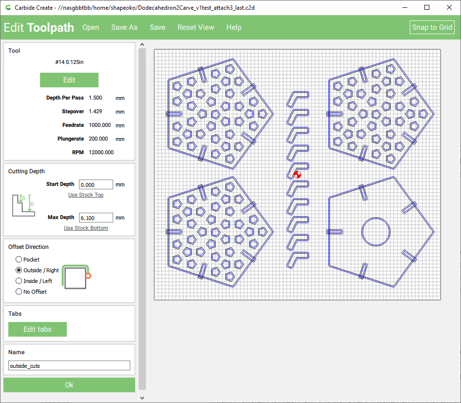
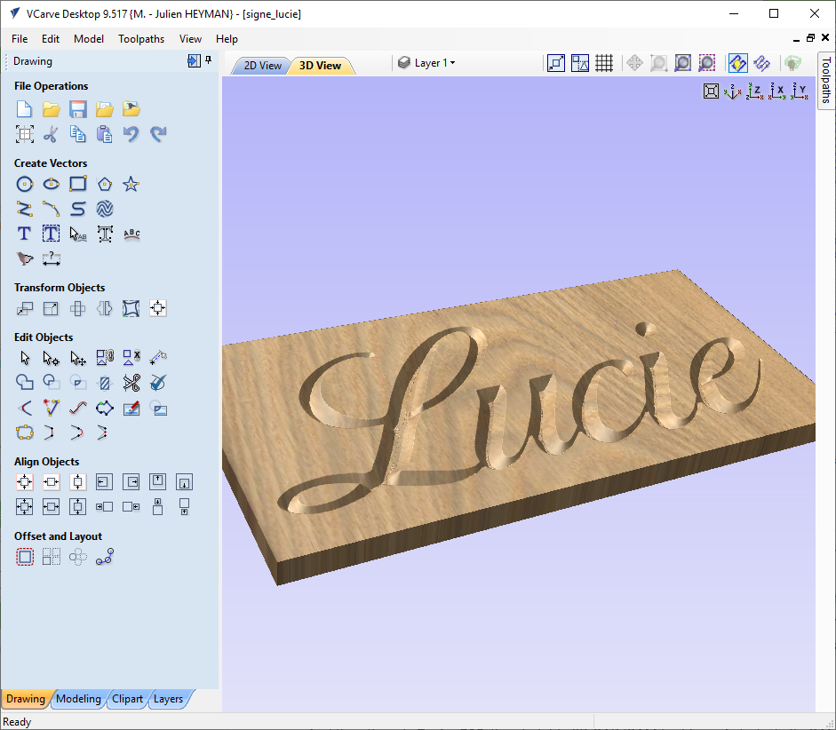
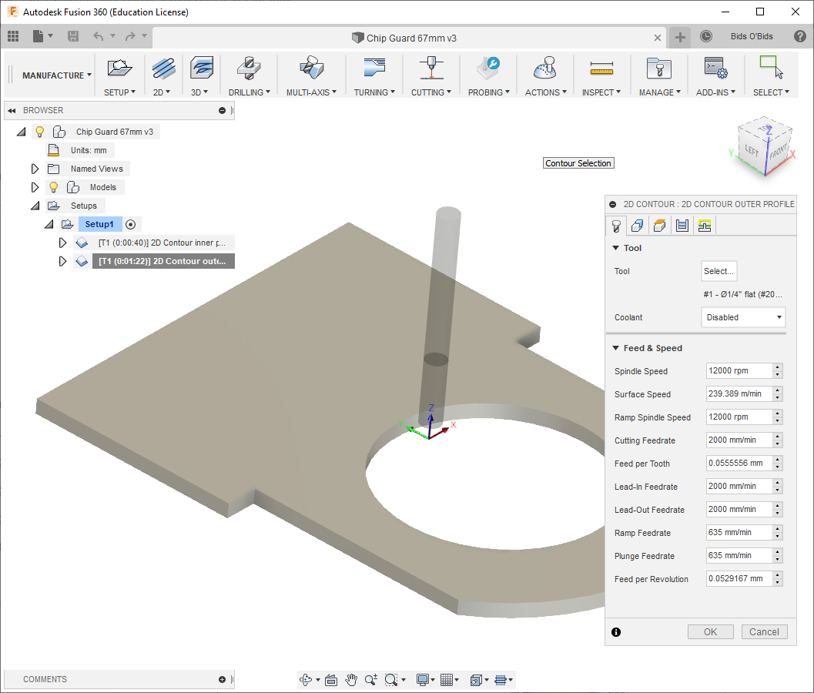
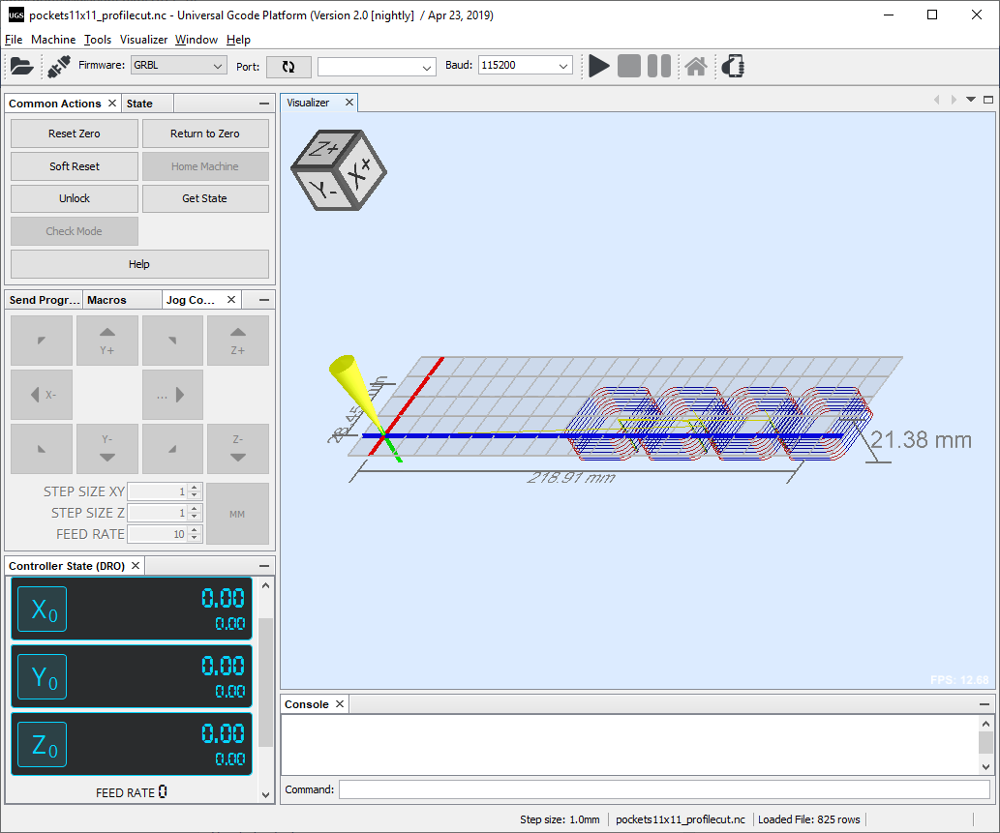
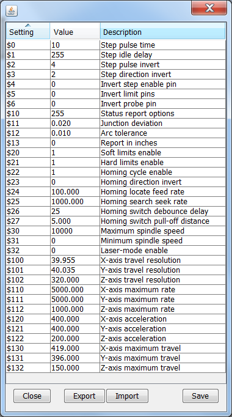

# CAD, CAM, and G-code

This section provides a brief overview of popular software for CAD, CAM, and sending G-code to the Shapeoko, at the time of writing. Most users start using their Shapeoko with Carbide Create and Carbide Motion, some stick to them while others move on to something else, for a variety of reasons.

## CAD/CAM tools

Most users obviously start with **Carbide Create,** which really is a great solution to get started with CNC, because it has _just_ the right amount of features to not overwhelm newbies with tons of parameters but still allow them to experience the full design workflow: stock setup, creating a 2D design, creating basic toolpaths based on these design elements, previsualizing these toolpaths and the final workpiece, and finally generate G-code to run on the machine.



If/once you outgrow it, Vectric **V-Carve** is a very popular \(albeit somewhat pricey\) upgrade path. The name is slightly confusing, as it is not only specialized in V-carving but is a complete generic CAD/CAM tool. The workflow is quite similar to Carbide Create's, which makes the transition easy. It has more CAD features \(layers, support for 2-sided machining,...\), intermediate-level CAM features \(built-in support for roughing and finishing strategy is great\), and it is just a very polished and robust software. You can also go crazy and buy the top of the line **Aspire** software from Vectric, if you need the advanced/pro features it offers.



And then there is **Fusion360**, the almighty 3D CAD/CAM tool from Autodesk. Its CAM module has all the bells and whistles and a truckload of settings, which is also why it has an admittedly steep learning curve that can repel many casual CNC users. But if you get past those first few weeks of figuring out its workflow and main settings, it opens up a fascinating range of possibilities, and not only for CNC. 

There is a small catch though: while it has an offline mode, this is primarily an online/cloud-oriented tool, it's from Autodesk, and it's free for students and hobbyist...for now. Not everyone feels comfortable investing a lot of time into learning how to use a tool that might become unusable locally if the servers are shutdown, or could become costly. Also, it does not do \(proper\) Vcarving. 



I happen to use all three, depending on the project at hand. I will use Carbide Create when I need a simple 2.5D piece done quickly and get cutting. V-Carve is my go-to solution for the 2.5D projects that are more complex \(need more structuring\) and/or involve Vcarving, 2-sided work, or require a roughing+finishing toolpath strategy. And then I will use Fusion360 for all things 3D, for metal work \(mainly because of the adaptive clearing feature\), and whenever I feel like I need to make the design parametric so as to be able to adjust dimensions without having to redesign everything.

Of course, there are many other CAD/CAM tools out there, those are the ones that are most popular at the time of writing in the Shapeoko community.


While the post-processor to generate G-code is built in Carbide Create, for VCarve and Fusion360 you need to initially configure it \(easy enough\) but then you get to tune it to your liking, which is very convenient.


## G-code primer

So the CAD/CAM tool generates G-code files. One can perfectly use the Shapeoko without any understanding of the G-code syntax, or ever opening a generated G-code file. Still, having at least a superficial understanding of what the most common G-code instructions do goes a long way for troubleshooting why the machine behaves the way it does.

G-code is a \(somewhat\) standard language to define instructions to be fed to multi-axis machines, CNC and 3D printers being prime examples.

A G-code file is usually a **plain text** file \(that can be opened with any text editor\), containing a sequence of G-code "blocks", i.e. lines of instructions. Each block \(line\) can contain several G-code instructions, but it often has a single command and its parameters, for better readability.

These instructions are being sent \(by e.g. Carbide Motion\) to the machine, that executes them **in order**.


G-code standard does define loop/jump instructions \(GOTO\), but they are not supported by GRBL anyway, so on a Shapeoko the G-code is guaranteed to execute from the top to the bottom of the file sequentially.


Here's the beginning of a random G-code example generated using Carbide Create \(other CAM tool produce slightly different variations of the code\) :

```text
%
(TOOL/MILL,0.1,0.05,0.000,0)
(FILENAME: )
()
G21
G90
G0X0.000Y0.000Z10.000
(TOOL/MILL,1.5875,0,1.0000,0.0)
M6 T112
M3 S10000
G0X0.000Y150.000
G0Z10.000
G1Z-0.250F300.0
G1X150.000F1200.0
Y0.000
X0.000
Y150.000

[...many other G-code instructions...]

G0Z10.000
M5
M30
(END)
```

Let's break this down:

* the **%** line just means "start of program". Well it actually means "Tape start", from the days where CNCs used tape readers. Anyway, this sign is optional, you will find some CAM tools add it, others don't.
* Everything between parenthesis is a **comment**, and is ignored by GRBL. This is just there for readability of the G-code file.
* **G21** is the command to set **units** to mm \(G20 being the command to set units to inches\)
* **G90** is the command to go to **absolute positioning** mode, i.e. all subsequent move commands will interpret X/Y/Z values as coordinates relative to the ZERO point currently defined. By contrast, G91 would activate relative positioning mode, and the X/Y/Z instructions would be interpreted as offsets from the current position.
* **G0** is the **Rapid Move** command, it takes X and/or Y and/or Z and/or Feedrate values as parameters, and is intended to reposition the tool to a different location while not cutting anything on the way.
* **M6 T112** corresponds to a **Tool Change** command, requesting tool number 112 in this example. On a Shapeoko, since there is no automatic tool changer, this is ignored by the machine \(but used by Carbide Motion to trig a user prompt\) 
* **M3 S10000** instructs the controller to turn the **Spingle on**, at 10.000RPM in this example.
* **G1** is the **Linear move** command, similar to G0 but intended to be used for actual cutting moves, that typically happen slower than the G0 rapid moves. The feedrate for these moves can be specified on the line, that's the **Fxxx**" part an the xxx is the feedrate value in units \(inch or mm\) per minute.
* Standalone coordinates like **Y0.000, X0.000, Y150.000** are in fact implicit/short versions of G1 move commands: as long as the movement mode does not need to be changed, the latest G commands applies and in this example the "G1" can be omitted from these lines.
* **M5** is used to turn the **Spindle off** 
* **M30** means "End of program" in GRBL.


* On a stock Shapeoko with a trim router, there is no automatic control of the router activation nor RPM, so the Spindle commands have no visible effect, but it does modify the output of the PWM signal on the controller board, which is used if you have a spindle
* The Shapeoko does not have an automatic tool changer, so M6 commands are ignored by the controller, but Carbide Motion uses the M6 tool change command to trig a user prompt.
* Spaces inside a line are ignored


Beyond this basic example, a few more common commands are:

* **G2/G3** commands to do **Arc moves**.
* **G17** explicitly selects the XY plane as the plane in which these arc moves are done.
* **G94** explicitly sets the feedrate values to be "units \(inch or mm\) **per minute**".
* **M8/M9** is Coolant on/off. Not applicable/ignored on the Shapeoko, but may be present depending on the post-processor used.
* **G54** is the command to select "coordinate system \#1", a.k.a. the coordinate system that is based on the Zero point you set. This command is optional since G54 is the default at GRBL startup anyway.

There are many, many more G-code commands, but basically the commands above will cover 99% of the need on a Shapeoko.

## G-code senders

Again, most users will initially use **Carbide Motion** to send G-code to the Shapeoko, and there is very good chance that many will never need to consider anything else. After all the workflow is quite simple \(load G-code, zero, run\), and Carbide Motion does the job.

But here are a few reasons why other senders can be considered too:

* **Live toolpath simulation**. It is quite convenient to be able to visualize the toolpaths contained in the G-code file that was loaded, if only to double-check that it looks right before running it, and then to monitor the cut and be able see what move is coming next in the toolpath.
* **G-code Macros**. Small snippets of G-code with associated buttons/shortcuts in the UI can be very useful to streamline the workflow. It can be as simple as just going to X0/Y0, or be a complex custom automated probing routine.
* **Machine limits customization**. While Carbide Motion is setup for a stock Shapeoko, and while it does provide access to modify the various GRBL parameters, some aspects are hardcoded \(e.g. the probe dimensions, that match Carbide3D's probe, or the Z limits that match a stock Z-axis\). If you start modding your machine, you _may_ come to a point where you need more customization than Carbide Motion allows.

There are many alternative G-code senders in various states of maturity/activity, I will just focus on the two that I have used, and seem to be most popular on the Shapeoko forum:

**Universal G-code Sender** is a cross-platform desktop application based on Java \(which in other words means you will be able to use it on any operating system\). Its UI looks a bit dated but it is simple and efficient. Here's a few highlights of why I like it:

* The G-code preview pane is particularly helpful: not only does it display the toolpaths in the currently loaded file with the associated max dimensions \(I check those every single time I load a file, as a double check\), it also shows where the tool is in realtime \(I like this feature when I need to check how many more depth passes are left until a pocket is finished, or where the tool will go next\):



* It has a very simple editor for GRBL parameters: just type in the value, hit save, and the new parameter is stored in the controller:



* It has configurable keyboard shortcuts for most of the actions, which makes it convenient to use a custom keypad \(see [Shapeoko setup](dust-collection.md#control-pad)\). Finally, I use the ability to define Macros, for simple but useful things like "goto X0Y0"
* It supports G-code filters, which can turn out to be convenient to ignore e.g. generated tool change commands. 

**CNCjs** is another popular sender, it has all the features of UGS and more, an arguably better-looking UI, and powerful macro capabilities. It comes either in a standalone desktop application:


or as a backend accessed via a web interface from any browser. This latter configuration makes it interesting for installation on a Raspberry pi \(or any other cheap computer that can be dedicated to being a G-code sender\):


In this configuration, a G-code file can be loaded directly from a web browser running on any device \(PC, Mac, tablet, smartphone...\), and CNCjs running on the Raspberry Pi takes care of feeding the G-code to the Shapeoko via the Raspberry's USB port. The device running the web browser can be turned off, or used for some other tasks, without impacting the ongoing job.

