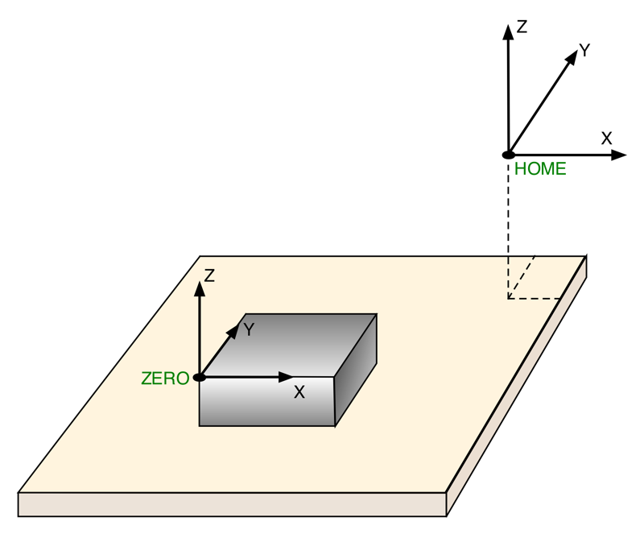

# CNC workflow

First things first, the **workflow** of a typical CNC job:

Everything starts in a **CAD** (Computer-Aided Design) program: this is where you will create the 2D or 3D objects to be machined. CAD software packages are usually able to import 2D and 3D features from a variety of file formats, and the most common/useful ones for CNC are "vector" or STEP formats.


_**Makera CAM**_, the CAD program provided by Makera for the Carvera can import SVG, DXF, STEP, and STL design files&#x20;


Once the object is designed, a **CAM** (Computer-Aided Manufacturing) module that is usually integrated in the CAD suite, is used to create **toolpaths** to cut the object out of a block of stock material (more on this later). Once all required toolpaths are created, the very last step in the CAM program is to generate one or several **G-code** files, containing instructions for the machine to move the cutter along these toolpaths.


G-code format is a standard (originally ISO 6983-1 back in the 80s) so one would expect that a G-code file can be run on any CNC. Well almost, but not quite. Different CNCs support different subsets of the G-code instructions, as well as implement their own custom instructions.


Since CAM programs are usually not bound to any specific CNC machine, they make use of a specific **post-processor** within them to generate the correct G-code for a given machine.


In _**Makera CAM**_, there is a single G-code post-processor that gets executed behind the scenes, since both the original Carvera and Carvera Air models use the same firmware.


If needed, a G-code viewer can be used to double-check the generated toolpaths, if the CAM tool does not have a toolpath preview feature. [NCViewer ](https://ncviewer.com/)is a popular (and free) online option.

Finally the instructions from the generated G-code files must be sent to the machine so it can produce the required movements of the spindle to cut through the material. The Carvera machines can playback G-code files, executing the instructions line by line but the file needs to be transferred to the machine's storage. This is done using a bit of software called the Carvera Controller. This is the control software for the Carvera family of CNC machines. Using this software you can manually move the spindle around, set machine parameters, as well as start playback of G-code files.


**Carvera Controller** runs on Windows, MacOS, Linux, Android, and iOS.


The Carvera machine has it's own control board that runs software that interprets the G-code instructions, and translates them into specific movements of the X, Y, Z and A motors. The Carvera uses a modified version of Smoothieware v1, an open source motion control software (see [https://github.com/Smoothieware/Smoothieware](https://github.com/Smoothieware/Smoothieware)).

It handles the detection of limit switches, and can manage a touch probe to help define and store the coordinates of the reference/starting point for the toolpaths.


The G-code file also contains instructions to control the **rotation speed** (RPM) of the spindle, as defined in the CAM program.


### Coordinate Systems

The coordinate system is one of those things that can be a little confusing at first. The axis definitions themselves are straightforward:

* **X** is the left–right axis, with values increasing from left to right.
* **Y** is the front–back axis, with values increasing from front to back.
* **Z** is what you would expect, vertical axis pointing up, so the "altitude" if you will.

The next question is, where is the origin? On a CNC like the Carvera, there is no mechanical feedback telling the machine where it is positioned in space at any given time, so the only thing it can do is control X/Y/Z movements **relative** to a given starting point.

The **ZERO or origin** point (X0,Y0,Z0) is the point in space against which all movements described in a G-code file will be referenced.

<figure><figcaption></figcaption></figure>

This point is usually referenced somewhere on the stock material (_e.g._, a corner or the center of the top face), but it could be set anywhere in the 3D workspace. The G-code for a given job will use this reference, and perform movements **relative** to this local origin. This is called the Work System Coordinate System (WCS).

However, the machine also has a **Home** position, which is where it can go to reset its location: the Home position corresponds to somewhere where the machine will get a physical feedback that it has reached the position, and on the Carvera that's above the back top right corner, where **homing switches** on the X,Y, and Z axis happen to be triggered.


Limit Switches are little mechanical micro switches at the ends of the different axis. They are triggered when the Spindle or Bed of the Machine hit them. This way the machine knows it cannot move any further.


**Homing** consists in telling the machine to move in the direction of positive X, positive Y and positive Z until it detects that each associated limit switch has triggered, and stop movement on the corresponding axis then. Once all three limits switches have been triggered, the machine is guaranteed to be in a known position (mechanically), i.e. Home. The machine tracks this location in it's memory as the Machine Coordinate System (MCS) based on the assumption that every movement command has been executed by the motors successfully.

If a G-code file is executed from an arbitrary zero point, why does it matter where Home is? The trick is that the **coordinates of the WCS Zero point** itself, are defined with respect to this Home position, and happen to be stored in the memory in the control board. Thus when executing G-code a WCS to MCS translation is performed to move the machine to the correct place.

When the machine is in an arbitrary position and is turned off, the next time it will be turned on, Homing allows to go back to this known **absolute** Zero point coordinates which it uses as the reference point for the MCS.


Due to the way the X/Y/Z axis are oriented, the Zero point in absolute machine coordinates will have negative values. But since everything will happen relative to the WCS anyway, you can just ignore this fact.


So the CAM tool doesn't know anything about the MCS but does know where it wants the cutter to move with respect to an arbitrary point defined in the CAM project. The CAM creates a G-Code file with instructions for movements within the WCS space. The WCS origin is set by the user using Carvera Controller before starting playback of a G-Code instruction file. The Carvera CNC machine interprets every G-code movement command, and applies it's knowledge of the WCS to MCS translation to move the spindle and bed to  the required places.
