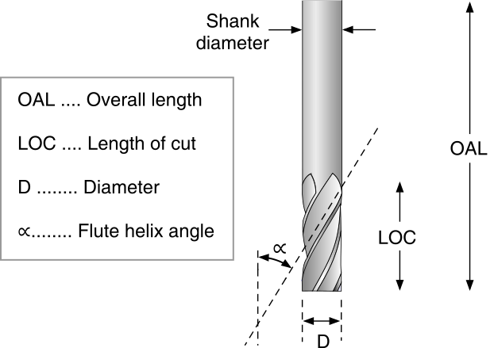
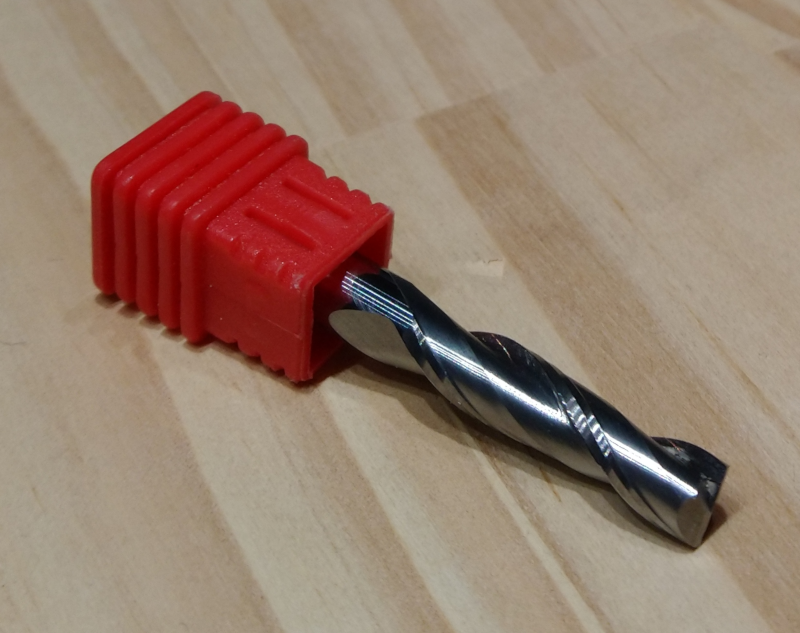

# Cutters

It's easy to be overwhelmed at first by the variety of cutters and their characteristics. Roughly, an endmill is characterized by:

* its **type/geometry,** which relates to its intended use:
  * **square** endmills are used for cutting flat surfaces _e.g._, pocketing and contouring, and for removing material quickly \(roughing\).
  * **ballnose** endmills are typically used for milling 3D surfaces.
  * **V-bits** are used to carve variable-depth grooves based on a 2D feature.
  * several other types are covered below but may require specific CAM features.
* the **diameter of its shank** \(the part that goes in the collet\)
  * a large shank is better for reducing deflection.
  * the choice of shank diameter is constrained by the available collets.
* the **diameter of its cutting part**
  * the most common sizes used on the Carvera are 1/8'' \(3.175mm\), 1/4'' \(6.35mm\),  1/16'' \(1.5875mm\), and 1/32'' \(~0.8mm\), and their metric cousins \(6, 3, 2, and 1mm\).
  * the smallest feature size in a design determines the smallest endmill diameter needed.
  * smaller endmills are more fragile and more sensitive to runout \(more on this below\).
* the **length of its cutting part \(**Length of cut / **LOC\)**, and its overall length \(**OAL**\).
  * a short LOC is better for stiffness, but obviously constrains the max depth of cut.
  * a long OAL provides better reach, at the expense of rigidity/deflection.
  * On the smallest diameter endmills, the cutting length is really short otherwise the tool would be extremely fragile and deflect too much
* the **number of flutes** \(number of cutting teeth\)
  * see [Feeds & speeds](feeds-and-speeds-basics.md) for the impact of the number of flutes.
  * fewer flutes are better for chip evacuation.
  * more flutes are better for stiffness and finish.
* the **material** it is made of:
  * **carbide** is king these days for CNC milling, but it is brittle.
  * **high speed steel** \(HSS\) is cheaper and tougher, but more limited in speeds.
* its **coating**, if any:
  * Generally, no coating is needed for cutting wood and plastics.
  * **ZrN** \(Zirconium Nitride\) coating is good for non-ferrous metals _e.g._, aluminium, brass, copper, titanium.
  * **AlTiN** \(Aluminium Titanium Nitride\) coating is good for steel/ferrous-metals but should be avoided for aluminium.
* whether it is **center cutting** or not:
  * most are, it means they have the ability to plunge into the material \(vertically\), like a drill bit does.
  * non-center cutting tools are more commonly used on manual power tools, think router bits. It is _possible_ to use them on a Carvera, but it requires a very careful CAM design.
* the **helix angle**, if it's a spiral endmill:
  * depending on the helix angle, cutting forces will be oriented differently between the axial and radial directions: it's not really something you should worry about.
* the **direction** of rotation
  * in practice virtually all endmills are designed for a **clockwise** tool rotation \(as seen from above the cut\)

## Square endmills

**Square** endmills are ****the workhorses of CNC milling. They come in several variants:

* **upcut**: the direction of the flute spiral is such that it pulls chips away from the cutting surface, thus is quite efficient at evacuating chips. It will produce a nice finish at the bottom of pockets, but can produce tear out on the top edges in some materials.
* **downcut**: it pushes chips downward when cutting, so is not efficient to evacuate them from the cutting area. It tends to do the opposite as an upcut, i.e. leaving produce a clean cut at the top edges of the cuts, but potential tear out at the bottom of pockets.
* **compression**: the flute geometry is such that it combines an upcut section at the bottom of the tool, and a downcut section at the other end of the cutting part, so for certain pocket depths it can give a nice finish both at the bottom and top of pockets.


If not specified endmills are normally upcut. The other variants are typically used when working with wood.


Here's an example for a 3-flute, 1/4'', upcut square endmill

It also comes in a version coated with zirconium nitride \(ZrN\) which minimizes the risk of sticking when cutting non-ferrous metals:

Here's an example of a 1/4'' endmill with only 2 flutes:

and here's a 1/4" one with a single flute \(a.k.a. "O-flute"\), that provides excellent chip evacuation:

**Downcut** endmills have their helical flute\(s\) oriented the other way, as in this 1/4'' 1-flute downcut:

Here's another downcut, 2-flute, 1/8'' endmill:

And then there are the funny looking **compression** endmills, that start with an upcut section at the tip, and have a downcut section higher up the shaft, here's a 1/4'', 2-flute version:

and a smaller 1/8'', 1-flute compression endmill:

## Corner radius endmills

Square endmills have a weak point, and that's the sharp tip of each of their flutes. In tougher materials \(like metal\) this is likely to chip, so one can use **corner radius** \(a.k.a. "bullnose"\) endmills instead: they behave very similarly to square endmills, but are much less prone to chip at the tip, hence can be used at more aggressive settings. Notice in the two pics below, the rounded corners \(top: TiCN-coated, bottom: ceramic-coated\)

## Ballnose endmills

Ballnose ****endmills are better suited for machining smooth 3D curves \(but are quite inefficient for machining flat pockets\), here's a 2-flute 1/4'' ballnose:

Here's a 0.032'' ballnose:

For carving fine 3D details, a **tapered** ballnose endmill can be very useful: the tip can be very small, but the tapered flutes make it much more robust than a straight endmill of the same tip diameter, so it can support much more aggressive feeds and speeds. Here's a tapered endmill with a 0.5mm \(0.02''\) ballnose tip:

## **V-bits**

V-bits come with various angles, they are typically used to carve text or tiny grooves \(more on this in the [Toolpaths](toolpath-basics.md#v-carving-toolpaths) section\):


Some people refer to v-bit angles as the angle of both sides of the cutter, while others refer to the angle of just one side.


## Surfacing bit

They usually have a very large diameter, to be able to surface a wide area in one \(very shallow\) pass:

## Diamond drag bit

The diamong drag bit has a tiny diamond on its tip, and is intended to be dragged across the surface of the material \(with the spindle not rotating!\) to engrave a 2D pattern on the surface. The tip is usually spring-loaded, so that the tip is always in contact with the surface with controlled pressure, while the bit moves around:

## Thread milling bit

Special thread milling bits are used in conjunction with very specific spiral toolpaths, to cut a inner or outer thread:

And there are many more, but these should cover a large part of the usecases/projects.
