# Cutters

<figure>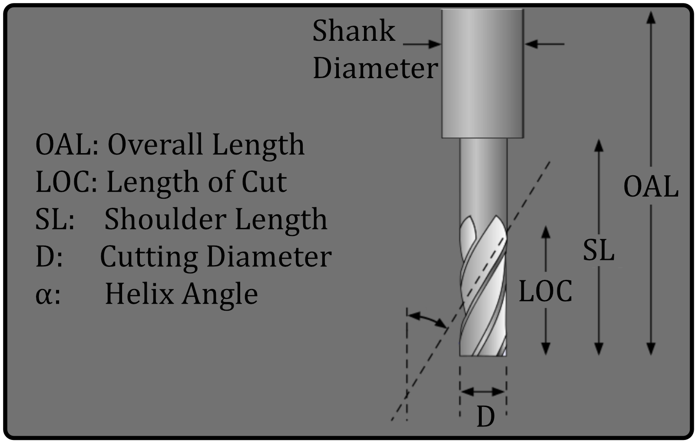<figcaption></figcaption></figure>

It's easy to be overwhelmed at first by the variety of cutters and their characteristics. Roughly, an endmill is characterized by:

### Tool Cutting Diameter

* the most common sizes used on the Carvera are 1/8'' (3.175mm), 1/4'' (6.35mm), 1/16'' (1.5875mm), and 1/32'' (\~0.8mm), and their metric cousins (6, 4, 3, 2, and 1mm).
* the smallest feature size in a design determines the smallest endmill diameter needed.
* smaller endmills are more fragile and more sensitive to runout (more on this below).

### Tool Cutting Length / Length of Cut/ LOC /  Flute Length

* a short LOC is better for stiffness, but obviously constrains the max depth of cut.
* On the smallest diameter endmills, the cutting length is really short otherwise the tool would be extremely fragile and deflect too much

### Overall Length / OAL

* a long OAL provides better reach, at the expense of rigidity/deflection.
* This affects the available length below the collet and therefore the absolute reach of the endmill
* You can shorten cnc bits:
  * it is better to buy the right size initially
  * Do not overheat the bit while cutting it
  * for HSS there will be a burr that you have to remove
  * for carbide&#x20;
    * you need cutting tools designed to cut carbide
    * it  creates some nasty dust. Wear a dust mask or respirator and clean up afterword
    * use an abrasive cutting wheel to score a line around the entire bit first. At a certain point the bit will probably snap at your cut point
    * it has a tendency to shatter during this process so wear PPE and be prepared to lose bits until you get used to the process

### Shank Diameter

* the diameter of the part of the endmill that fits into the collet
* a large shank is better for reducing tool deflection.
* the choice of shank diameter is constrained by the available collets. The more shank diameters you have the more collet swaps you will have to do.

### Shoulder Length / Diameter

* on some endmills there is part of the endmill between the where the cutting flutes end and the shank diameter begins.&#x20;
* Shank diameter is often the same diameter as the cutting diameter to allow you to cut deeper that the flute length. The shank will be stiffer an area with cutting flutes ground in
* O flute endmills have 0 shoulder length and the shoulder diameter is often slightly larger than the flute diameter. Therefore you should not cut deeper than the flutes on a O flute endmill as the shoulder will rub
* There are reduced shoulder endmills where the shoulder is narrower than the cutting diameter for niche use cases. You can reduce the shoulder on endmills with the same caveats as shortening them.

### **Number of flutes** (number of cutting teeth)

* see [Feeds & speeds](feeds-and-speeds-basics.md) for the impact of the number of flutes.
* fewer flutes are better for chip evacuation.
* more flutes are better for stiffness and finish but you need more air assist to prevent chips from packing up and snapping your endmill

### Helix Angle

* helix angle is how quickly the flutes of some cnc bits spiral around the center axis. There is a lot of nuance to choosing helix angle that is largely irrelevant in the hobby cnc space. Generally:
  * Larger helix angles are better at chip evacuation, produce a better finish and can be run at higher feed rates. On the con side they can get pulled out of the collet easier, and are more prone to chip out where the top or bottom of the cut chips instead of cuts cleanly.&#x20;
  * Smaller helix angles are generally used on roughing endmills.&#x20;
  * If you are curious: [https://solutions.travers.com/metalworking-machining/milling/the-pros-cons-of-high-and-low-helix-angles](https://solutions.travers.com/metalworking-machining/milling/the-pros-cons-of-high-and-low-helix-angles)

### Helix Direction

* refers to if the flutes spiral with or against the rotation of the endmill. This is a larger consideration for wood/composites than for metals
* Up Cut Endmills: When you rotate the bit in the correct direction it looks like the flutes are rising up
  * removes chips out the top so you don't re-cut them/they don't clog the hole you are working on
  * can chip the very top edge of the cut depending on the material, less likely to chip/ leave a burr on the bottom surface of a through hole
  * Think of these as the defult you should be buying
* Down Cut Endmills: when you rotate the bit in the correct direction it looks like it is pushing the flutes into the material
  * less likely to chip out the top edge of a cut but more likely to chip out the bottom edge of a cut
  * Will cause build up of chips in pockets/holes unless you are cutting all the way through the material and it has space underneath to let the chips fall out. You need air assist or a spindle fan to clear these chips.
* Compression Endmills: Do both! But you have to figure out how to get the transition between up and down cut somewhere inside the middle of the cut so they are specialty.

This is an example of an upcut endmill

<figure><figcaption></figcaption></figure>

**Downcut** endmills have their helical flute(s) oriented the other way, as in this 1/4'' 1-flute downcut:

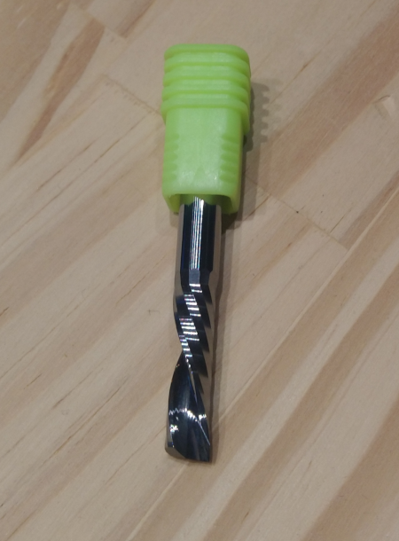

Here's another downcut, 2-flute, 1/8'' endmill:

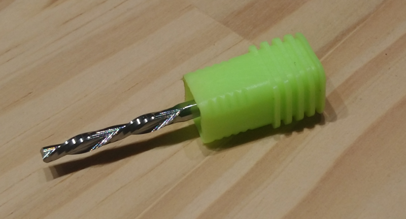

And then there are the funny looking **compression** endmills, that start with an upcut section at the tip, and have a downcut section higher up the shaft, here's a 1/4'', 2-flute version:

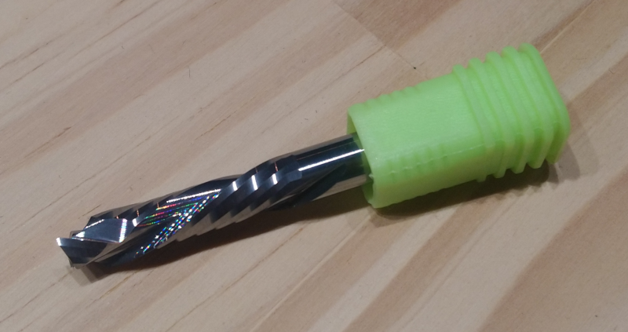

and a smaller 1/8'', 1-flute compression endmill:

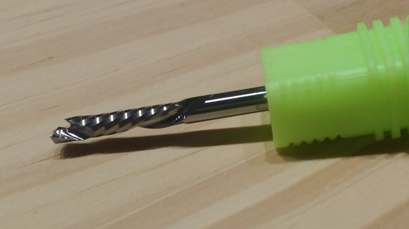

### Material

* **carbide** is king these days for CNC milling. It:
  * can be run at higher temperatures
  * can usually take higher feeds and speeds
  * is not sharpen-able
  * is brittle and liable to snap
  * can cut harder materials
  * has some issues with thermal shock that are unlikely to show up on small cnc machines
* **high speed steel** (HSS) is the traditional material for milling bits. It:
  * is cheaper
  * tougher (harder to snap)
  * wears out faster
  * can be sharpened, though this is usually impractical for small bits
  * less expensive for larger milling bits than carbide
* &#x20;poly crystaline / mono crystal diamond are exotics. They:
  * are a large step up from carbide in tool life
  * can be the sharpest of the options and can leave mirror finishes. MCD can be atomically sharp
  * are good for abrasive materials like fiberglass / carbon fiber
  * do well with many non-ferrous metals, but do not do well with ferrous materials
  * are very expensive
  * are incredibly brittle. If you drop it on a hard surface it is likely ruined
  * Geometry is very limited
* Carbide Insert Tooling
  * Put the expensive carbide only where you need it
  * the cutting edge is replaceable
  * outside of facemills and fly cutters, insert tooling is usually too large for small cnc machines like the Carvera line.&#x20;

### Coating

* Endmill coatings can improve wear resistance, heat resistance and reduce cutting friction.&#x20;
* Generally, no coating is needed for cutting wood and plastics.
* For Aluminum, make sure the coating does not include Al such as **Al**TiN. The coating incompatibilty can cause chip welding (where some of the material being cut gets stuck to the cutter), increased tool wear, heat, rubbing against the part instead of cutting and often endmill breakage.
* **Bright/Uncoated**: No fancy finish on the bit. Can be slightly sharper than a coated bit and is often used for Aluminum.&#x20;
* **DLC** (Diamond Like Coating): Looks like a rainbow, best in class for aluminum. Is compatible for all material types.&#x20;
* **ZrN** (Zirconium Nitride) coating is good for non-ferrous metals _e.g._, aluminium, brass, copper, titanium.
* **TiN** (Titanium Nitride) Gold color. Suitable for most materials, focuses on wear resistance with a bit of reduced friction
* **AlTiN /** TiAlN (Aluminium Titanium Nitride) Dark grey color. Good for steel/ferrous-metals but should be avoided for aluminum. Focuses on high heat and wear resistance
* **TiCN** (Titanium Carbon Nitride): Dark grey/coppery color. Focuses on wear resistance and low friction but does not work well at higher speeds.&#x20;
* **CVD** (Chemical Vapor Deposition) Diamond Coating: Focuses on wear resistance above all else. Best for long production runs in graphite, ceramic, carbon fiber, fiberglass, high silicon aluminum. Do not use for ferrous metals. Very expensive.

### Center Cutting

* most cnc machine specific endmills are center cutting, meaning they have the ability to plunge into the material (vertically), like a drill bit does.
* non-center cutting endmills are more commonly used on manual power tools, think router bits. It is _possible_ to use them on a Carvera, but it requires a very careful CAM design.
* Many specialty CNC bits are non-center cutting, such as T slot cutters
* Ball endmills are generally considered non-center cutting as all of the force of the cut would be concentrated on the end of the sphere where the cutting flutes are effectively not moving in relation to the work. See the ball endmill section below
* If an endmill is not center cutting you can:
  * start the cut off the side of the workpiece in open air and only move in the XY plane when cutting
  * create a pilot hole for the bit using a center cutting bit first
  * adjust the cutting profile to use the side of the bit for vertical traversal. This can often be done with helix ramping or offsetting the cutting tip

### Rotation Direction

* in practice virtually all endmills are designed for a **clockwise** tool rotation (as seen from above the cut)
* On the Carvera do not buy endmills meant to spin counterclockwise, the motor only spins 1 way.

## Cutter Geometry

### Square Endmills

**Square** endmills are the workhorses of CNC milling. This will generally be the default you reach for.

Here's an example for a 3-flute, 1/4'', upcut square endmill

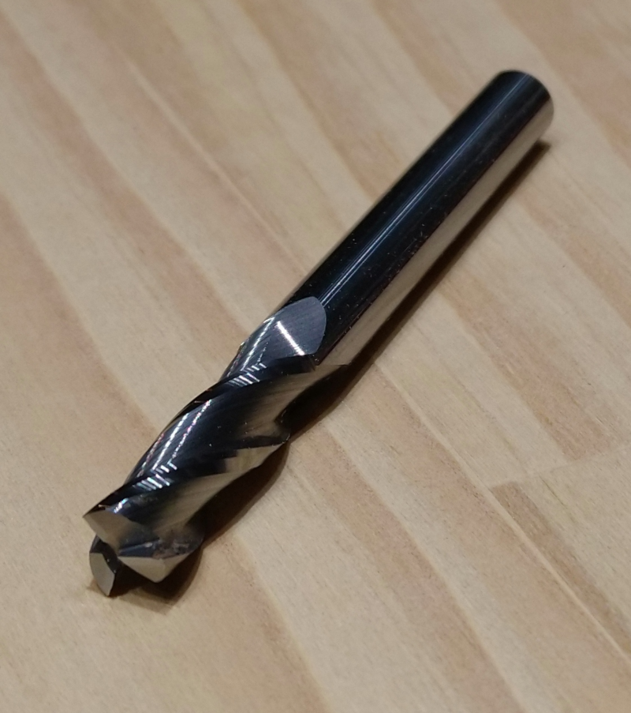

It also comes in a version coated with zirconium nitride (ZrN) which minimizes the risk of sticking when cutting non-ferrous metals:

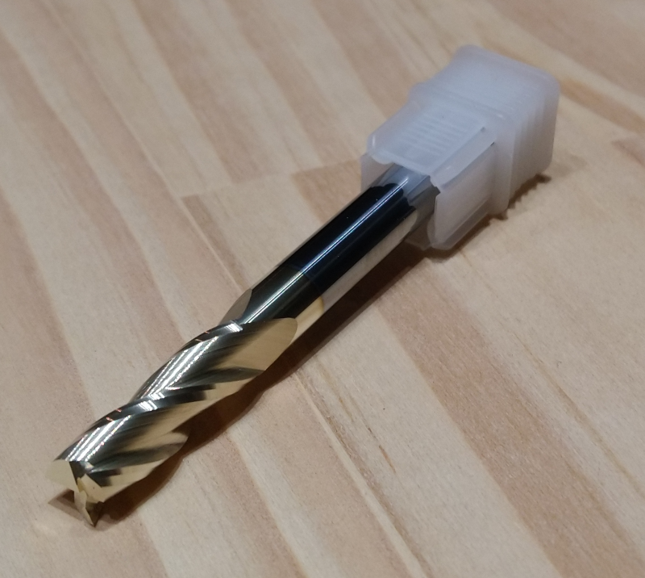

and here's a 1/4" one with a single flute (a.k.a. "O-flute"), that provides excellent chip evacuation:

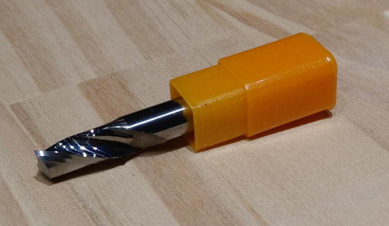

There are endmills dedicated for roughing operations (left) vs finishing operations(right). The serrations on the roughing endmill break up the chips better and allow you to take heavier cuts at the expense of a much worse surface finish. Finishing endmills have extra relief on the cutting edges to make the cutting edge sharper. They produce a better finish at the expense of wearing out faster. You want to use a feature like stock to leave to tell your cam software to keep away from edges when roughing, and to leave a very small, even thickness of material for the finishing endmill to cut for the best finishes.&#x20;

<figure>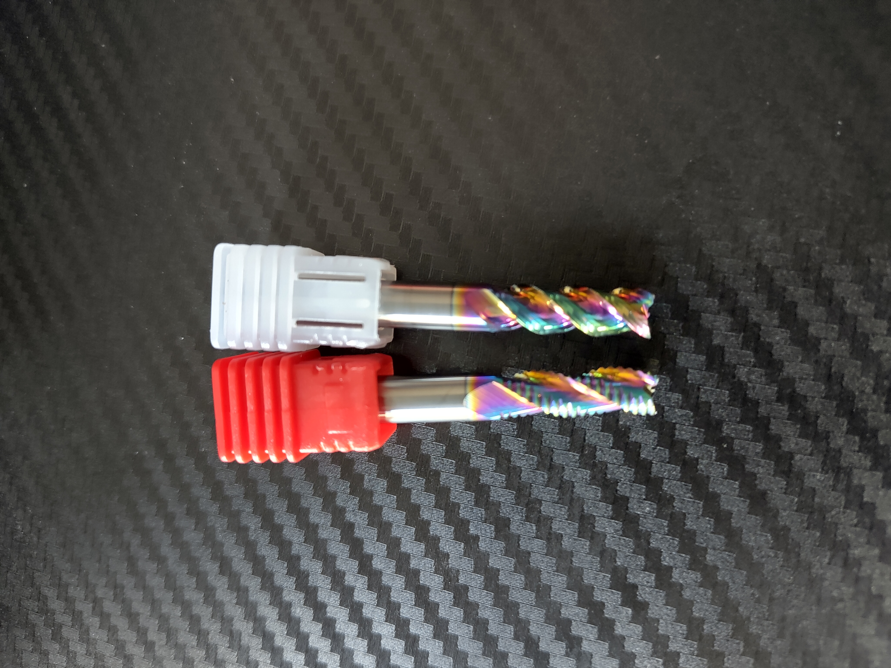<figcaption></figcaption></figure>

### Ballnose endmills

Ballnose endmills are better suited for machining smooth 3D curves (but are quite inefficient for machining flat pockets), \
\
Here's a 2-flute 1/4'' ballnose:

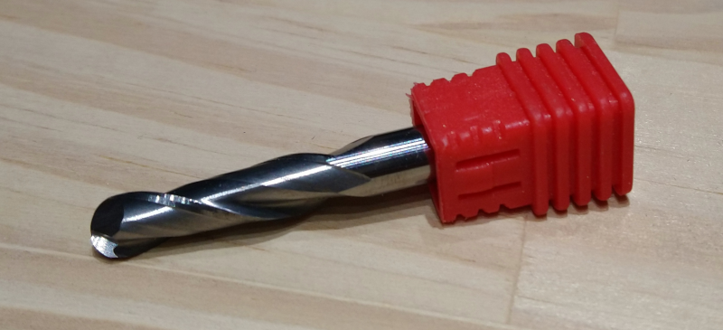

Here's a 0.032'' ballnose:

.png>)

For carving fine 3D details, a **tapered** ballnose endmill can be very useful: the tip can be very small, but the tapered flutes make it much more robust than a straight endmill of the same tip diameter, so it can support much more aggressive feeds and speeds. Here's a tapered endmill with a 0.5mm (0.02'') ballnose tip:

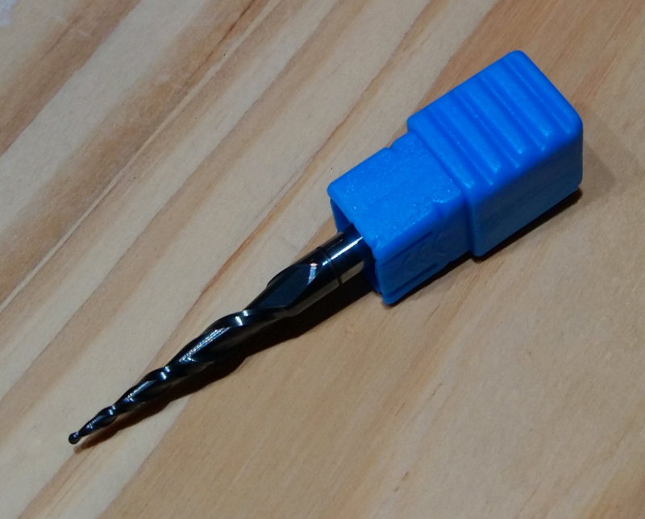

### Corner radius endmills / Bull Nose Endmills

Square endmills have a weak point, and that's the sharp tip of each of their flutes. In tougher materials (like metal) this is likely to chip, so one can use **corner radius** (a.k.a. "bullnose") endmills instead: they behave very similarly to square endmills, but are much less prone to chip at the tip, hence can be used at more aggressive settings.&#x20;

They are also have some of the benefits of a ball endmill. The radius section of the endmill can create smooth curved/slanted surfaces while maintaining the ability to cut flat bottomed pockets with the flat section.

The small corner radius creates a fillet on internal corners, which can increase strength by reducing stress risers. If a mating part has to fit inside the pocket, you will need to chamfer or corner round the smaller piece to make sure the fillet does not interfere with the fit.

The bull nose's advantages really lend itself to 4th axis work

Notice in the two pics below, the rounded corners (top: TiCN-coated, bottom: ceramic-coated)

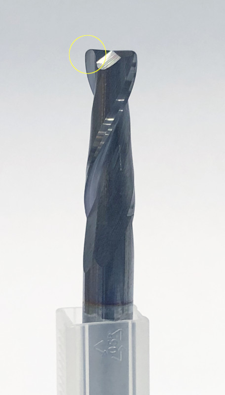

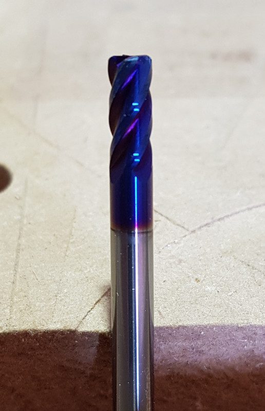

### V-Bits

V-bits come with various angles, they are typically used to mill circuit board traces, carve text / tiny grooves into parts / add detailed carving to a part(more on this in the [Toolpaths](toolpath-basics.md#v-carving-toolpaths) section)

Similar to tapered ball end mills the taper on the bit lets it reach further into a part without collision.


Some people refer to v-bit angles as the angle of both sides of the cutter, while others refer to the angle of just one side. Make sure to double check your CAM software against the toolbit to make sure the angles match. Fusion360 uses half angles, Freecad and Makera Cam use the full angle.


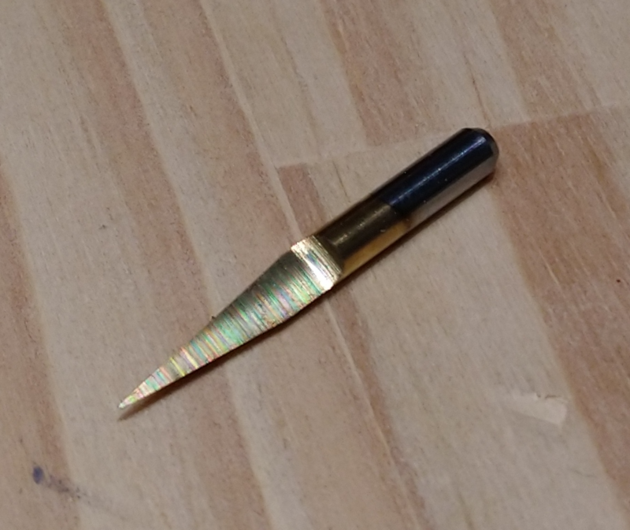

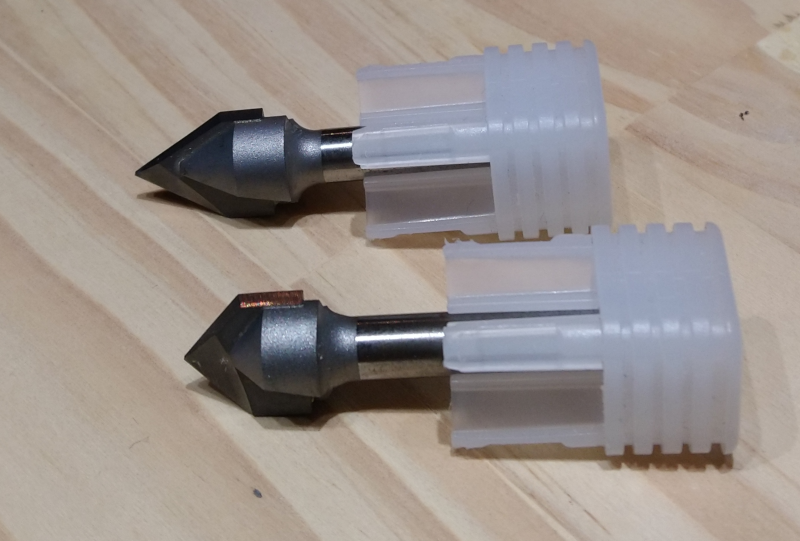

### Choosing between Ball Nose Endmill, Bull Nose Endmill And V-bits

<figure>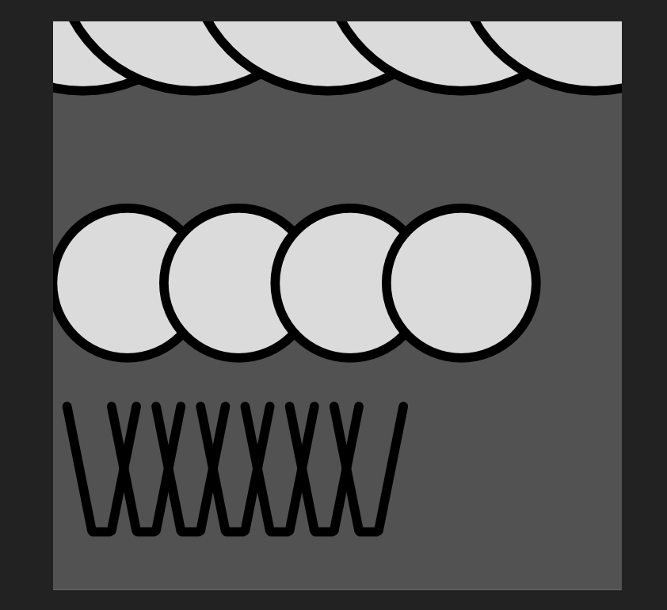<figcaption></figcaption></figure>

The top two are the end of ball endmills, the bottom one is a vbit
\
When working with ball endmills and vbits you are always going to leave a series of small grooves on the part. When you are machining you set your stepover to minimize this value to an acceptable amount.
\
The larger the tip of the endmill, the smoother the sides of the grooves created, making them less noticeable, at the cost of losing the ability to make smaller features.
\
Generally you want to use the largest size endmill that will create the features that you want as you can use larger stepovers for the same surface finish. In the example above see how the top set of circles is further apart, but the ridges are less pronounced than the middle ones.
\
V bits tend to make sharper ridges more like threads as well.

The soft edges of ball endmills are also better for sloped surfaces as there is not the hard corner, it hides transitions better and is easier on the bit
\
V bits are easier to make smaller sizes on, so they will be more common for very small details

For a project with a lot of 3d detail, I would use a large ball endmill to get the majority of the shape, clean up the small details with a smaller ball endmill, and finish any super sharp engraving with a v-bit if needed.

Since ball endmills do not have a flat bottom, they are less good at flat horizontal surfaces. If you want a bit that can do flat surfaces with decent finishes on sloped surfaces, bull nosed endmills have a flat bottom with radiused corners.\
\
When using endmills with a radius, it is a good practice to rough out the part with a flat or bull nosed endmill to get a stepped approximation of the final shape, do a semi-finishing pass with the ball endmill to get an even thickness of material to remove for the finishing pass (you can use a larger stepover than you would for a finish pass as the ridges will be removed in the finish), and then finish with the smaller stepover.

It is also best practice to cut with the side of a ball endmill and not the bottom face. This is often accomplished by making the toolpath start at the bottom of a surface and move to the top\
.png>)\
See in this image, if you start at the bottom and move up the surface, most of the cutting is happening on the side of the ball, whereas if you started from the top and moved down you would always be cutting with the center

### Chamfer End Mill

Sharp edges on cnc milled parts are uncomfortable or even dangerous to handle, can interfere with assembly, and are unsightly. Chamfer endmills allow you to cut a small angled surface on the top of previous cuts to mitigate all of those problems. Chamfer endmills can also be used for engraving into parts similar to v-bits. \
Chamfer End Mills come in different chamfer angles, the most common is 90 degrees (sometimes called 45 degrees, see the v-bit section for why)

<figure>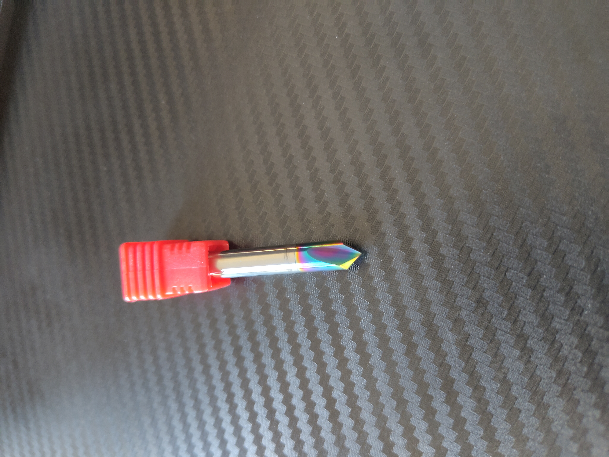<figcaption></figcaption></figure>

### Corner Rounding / Inner Radius Endmills

If a angled surface to break edges is not quite nice enough, you can buy endmills specifically designed to add a rounded corner onto those sharp edges. They require careful setup to get the edges to blend correctly

<figure><figcaption></figcaption></figure>

### Lollipop Endmills

These are just ball endmills that you can use on the underside of parts in addition to the top. Thus you can add radiuses/chamfers to the bottom of a hole you milled without having to flip the part over. These are much trickier to use than anything else on this page.&#x20;

<figure><figcaption></figcaption></figure>

### Fly Cutters

No image for this cutter yet.\
Fly cutters are a single cutting edge to take off material from the top surface of a part. They can produce superb finishes, but are slow and require a lot of space around the top of the part to be free as the spinning cutting bit has to go off the edge of the part by its full diameter to get the best finish. \
So far I have not seen any attempts to use a fly cutter on the Carvera line of machines

### Surfacing bits / Face Mills

A face mill is a fly cutter with multiple cutting edges, there has been a video showing one off on the carvera Z1:

[https://www.youtube.com/watch?v=eg7sAZ5su-w](https://www.youtube.com/watch?v=eg7sAZ5su-w)\
\
They are great for removing large amounts of material in very shallow passes and can create great surface finishes, but struggle with the same issues as fly cutters. \
\
Other surfacing bits from routers exist, such as the one below, do not use them on the Carvera.

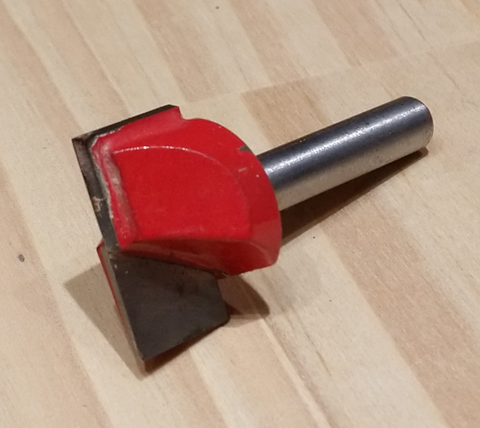

### Diamond drag bit

The diamong drag bit has a tiny diamond on its tip, and is intended to be dragged across the surface of the material (with the spindle not rotating!) to engrave a 2D pattern on the surface. The tip is usually spring-loaded, so that the tip is always in contact with the surface with controlled pressure, while the bit moves around:

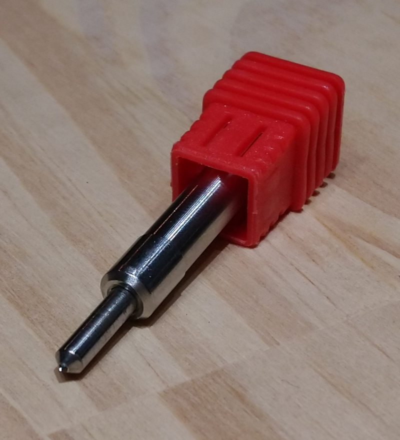

### Single Flute Thread milling bit

Special thread milling bits are used in conjunction with very specific spiral toolpaths, to cut a inner or outer thread:

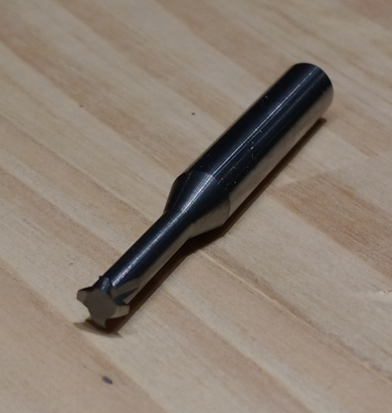

### T Slot Cutters

T slot cutters allow you to make undercuts in parts, grooves for T nuts / O rings / sliding parts, and other similar features. You can cut at multiple depths to increase the size of the resulting slot larger than the cutting tool height. They are more difficult to set up CAM for.

<figure><figcaption></figcaption></figure>

<figure><figcaption></figcaption></figure>

### Dovetail Cutters

Dovetails are a common machining feature for linear sliding/fixturing mechanisms. They are often coupled with adjustment gibs to tune the amount of friction on a joint.&#x20;

When milling with a dovetail cutter you usually want to start with a slot slightly deeper than the bottom of the dovetail to give plenty of clearance, and then cut each side of the dovetail in multiple passes.

<figure><figcaption></figcaption></figure>

<figure>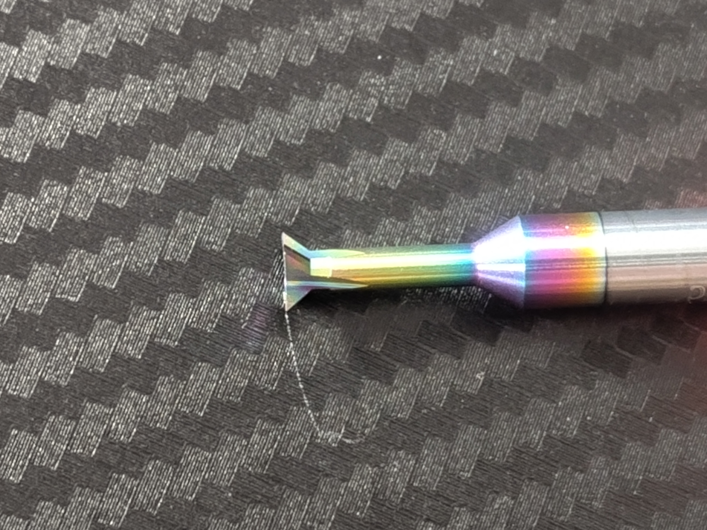<figcaption></figcaption></figure>

There are a LOT of other cutter types on the market for niche use cases. These are the ones you are most likely to come across on the Carvera
