# Feeds & Speeds

The whole "feeds & speeds" topic is arguably the most daunting part of learning CNC.

"**Feeds**" is feedrate, on some CNCs with a fixed tool and moving plate this is the speed at which the material is fed into the cutter, on a Carvera this is the speed of the cutters movements into the material.

"**Speeds**" is the rotation speed of the endmill, i.e. RPM value.

"Feeds" and "Speeds" go hand in hand, what really matters is the _combination_ of feedrate and RPM values for a given situation. Actually, they are also somewhat coupled with a number of other parameters (_e.g._ depth and width of cut), so "feeds and speeds" is often short for "all the cutting parameters".

When first starting CNC, selecting adequate cutting parameters feels a little bit like this:

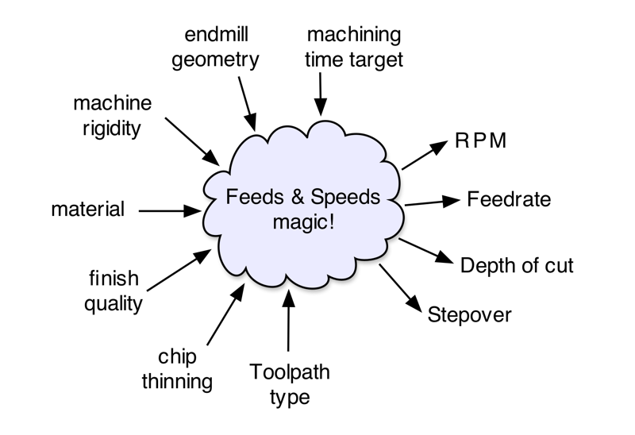

Using proper feeds and speeds and depth/width of cut values is important to :

* get a good quality of the cut (_e.g._ surface finish, dimensional accuracy)
* increase tool life (i.e. keep tool wear to a minimum), or at least avoid tool breakage.
* avoid/minimize chatter (the horrendous sound heard when the endmill/machine vibrates while cutting through the material)
* optimize material removal rate (_e.g._ how long it takes to complete the cut)

While there is definitely a good amount of experience (and experimentation) involved in finding the perfect feeds and speeds for any given situation, there are a few underlying principles that are worth understanding for two reasons:

* to figure out reasonable values to **start** from, when a new situation shows up for which you cannot find any predefined recommended values.
* to be in a position to understand how to **tune** the cutting parameters to achieve the desired result.


This section includes a little math (nothing too fancy), but not to worry: while it is important to understand the _dependencies_ between the cutting parameters, calculators will take care of all those computations for you.


Before diving into the relation between feedrate, RPM, and the other parameters, let's check how the tool cuts into the material.

## Conventional Milling

In so-called "conventional" milling, the direction of the endmill movement is such that the cutting edges bite from the inside to the outside of the material. In the sketch below, imagine the blue triangle represents one cutting edge of the endmill. If the blue cross is the position of the center of the endmill when this cutting edge starts biting into the material, and if the endmill is moving into the material at feedrate F, then a little bit later the endmill center is at the position of the purple cross, and the cutting tooth has rotated and gone out of the material. The resulting chip of material that was cut during that time is the green part.

It starts out very thin, and gradually increases in thickness. The maximum thickness (noted "C" below) happens when the cutting edge exits the material. It is typically called the "feed per tooth" or "chipload per tooth", or usually just "**chipload**", and this is the cornerstone of feeds and speeds.

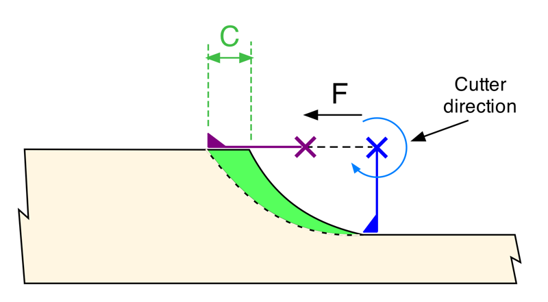

## Climb Milling

"Climb" milling is when the direction of the endmill movement is such that the cutting edges bite from the outside to the inside of the material. In that situation, a cutting edge first bites a large chunk of material (blue position), and as the endmill rotates and moves to the right at feedrate F, the cut gets thinner, until the tooth has nothing left to cut (purple position). The resulting chip (in green) has a similar shape to that in conventional milling, and again the max thickness of the chip is the chipload.

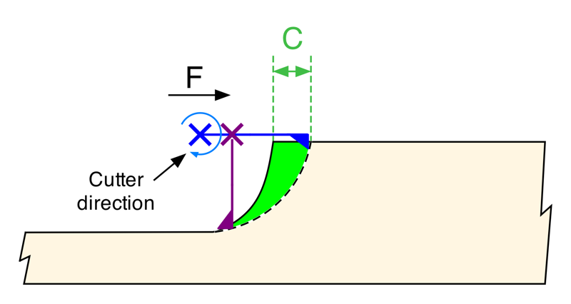

## Chiploads

So why does chipload matter so much ?

A large chipload requires a lot of spindle torque and machine rigidity, and each endmill has recommended chipload limits from the manufacturer anyway (i.e. there's always a limit to the size of the bite you can take, whether you're a squirrel or a white shark).

A too small chipload is actually worse: since the cutting edges are not infinitely sharp, at some point instead of slicing into the material, the cutting edges will mostly rub against the surface, and then "heat happens" and this is very bad for the quality of the cut and for tool life. In CNC, rubbing is the enemy.

So this is a Goldilocks situation: the chipload must be high enough to avoid rubbing and overheating of the endmill, and small enough to be within the torque/rigidity limits of the machine and the endmill's rated maximums.

Each flute contributes in turn to removing material during one revolution of an endmill. If we sketched N successive bites that the endmill takes into the material, it would look something like this:

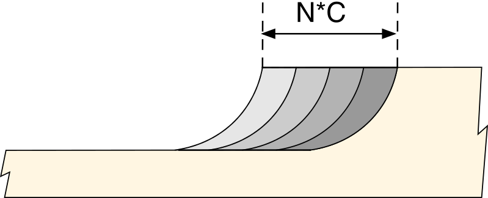

If the endmill has _N_ flutes, one revolution will cut _N_ chips, i.e. a length of _N_ × _chipload_ of material. Since the endmill revolves at _RPM_ turns per minute, in one minute a length of _N_ × _chipload_ × _RPM_ will have been cut. And the distance being cut per minute is exactly the definition of feedrate, therefore _Feedrate_ = _N_ × _RPM_ × _Chipload_, which also means:

$$
Chipload = \frac{Feedrate}{Nb\_Flutes × RPM}
$$

This relation is quite intuitive:

* for a given endmill and RPM, the faster the feedrate the larger the chipload.
* for a given feedrate and RPM, an endmill with more flutes will cut thinner chips.
* for a given feedrate and endmill, the faster the endmill rotates the thinner each chip will be.

The important takeway here, is that there are many possible combinations of feedrate, endmill type, and RPM to reach a given chipload. Say you are using a feedrate of 1000mm/min (39ipm), and a 3-flute endmill at 10,000RPM. Given the formula, you may just as well use a 2-flute endmill at 15,000RPM, or keep the 3-flute endmill but spin it at 7,500RPM while decreasing the feedrate to 750mm/min, the chipload thickness would be the same:

$$
\frac{1000}{3 × 10,000} =  \frac{1000}{2 × 15,000} =  \frac{2000}{3 × 20,000} =0.033mm
$$


This also means that if your CAM tool comes up with feedrates or RPMs that are not in the range of your machine's abilities (_e.g._, recommended RPM lower than the minimum RPM of your spindle), you can just scale both RPM **and** feedrate values by any factor, and it will still provide the same chipload.


For a given chipload, some combinations are still better than other mathematically-equivalent ones though (more on this below). Since the feedrate/RPM combination is derived from the desired chipload value, let's first have a look at what the range of acceptable chipload values is for the Carvera.

## Carvera chiploads guideline

For the **minimum** chipload value to avoid rubbing, there is a large consensus in the CNC community that a value of **0.001''** (0.0254mm) is a good absolute lower limit guideline, at least for 1/4'' endmills and larger. It may need to be lowered to 0.0005'' for 1/8'' and smaller endmills.


This is assuming you are using a **sharp** cutter. You should never use a dull cutter anyway, if you do you may end up rubbing even at this 0.001'' chipload.


The **maximum** reachable chipload depends on a lot of things, but mostly:

* the **hardness of the material** being cut
* the **type and diameter of the endmill** (smaller teeth need to take smaller bites: the maximum chipload for a given endmill scales linearly with its diameter)
* the **toolpath** used (how wide/deep the cutter is engaged) and the **rigidity of the machine**: it is quite easy to forget that the Carvera is not as rigid as industrial CNCs, so endmill manufacturers recommendations will likely not be directly suitable for the Carvera. Any mechanical mod of the machine also impacts the max chipload capability.

Finally the Carvera's spindle limits must also be accounted for, it's max torque, and min/max speed.

Now we have to take a little detour and talk about stepover, because it impacts the _effective_ chipload.

## Stepover/WOC/RDOC

"**Stepover**" refers to the offset distance of the endmill axis between one cutting pass and the next one, which also translates into how much new material is being removed by the endmill, or how much radial engagement is put on the endmill. It's also called Width of Cut (**WOC**) or Radial Depth of Cut (**RDOC**)

In the example below, the stepover S is 50% of the endmill diameter:

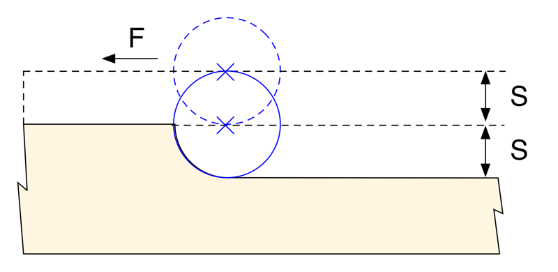

The larger the stepover, the larger the force on the endmill. Cutting passes with a small stepover are better for surface finish quality, while passes with large stepover obviously reduce overall cutting time since fewer passes are required to cut a given amount of material. And then **depth** of cut will also come in the picture (more on this later).

As a side note, for ball endmills, stepover value influences surface finish quite a lot. Consider the following sketch of a side view showing multiple passes:

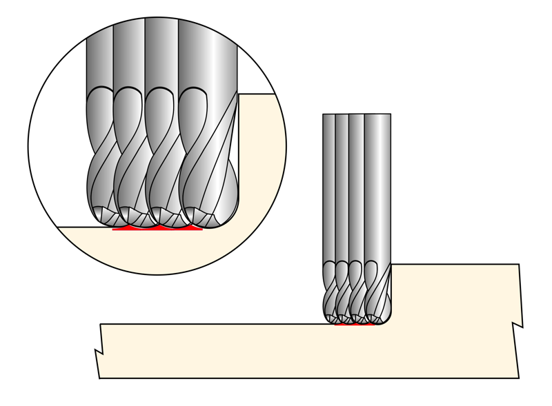

Due to the geometry of the endmill tip, scallops of residual material will be left at regular intervals on the bottom surface. These will be more or less visible depending on how well the material can hold small details (a 20% to 33% stepover should be small enough for wood, while it could need to be lowered down to 10% stepover for metal)


Stepovers of greater than 50% should be avoided as this results in cutting in both convientional and climb directions at the same time. This has the downsides of both with the only benefit being larger surface of material removal. Expect worse surface finish, reduced tool life, and often long dangerous balls of chips."


## Chip thinning

The chipload values discussed earlier assumed that the stepover is at least 50% of the endmill diameter:

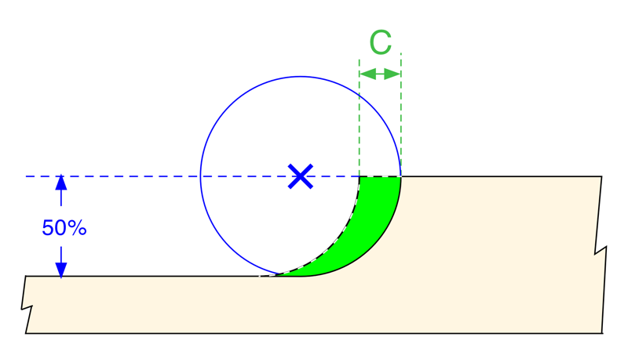

Now consider what happens if the stepover is lower than 50% of the diameter, say 20% only:

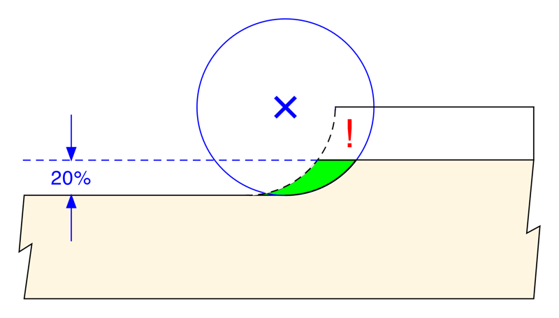

For the same RPM and feedrate, the _actual_ chip is smaller, its maximum thickness is smaller than targeted, so there is again a risk of rubbing, or at least of sub-optimal heat removal.

The solution is to artificially target a higher chipload value (all other parameters staying the same), such that the actual size of the chip is increased to approximately what it _would_ have been if the cutter were engaged at 50%:

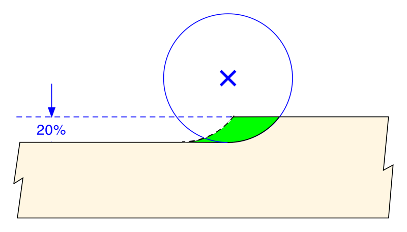

The formula to determine this higher, adjusted target chipload is:

$$
Chipload(adjusted) = \frac{Diameter}{2 × \sqrt{(Diameter × Stepover) - Stepover^2}}× Chipload
$$


For basic toolpaths in soft materials, the stepover is often in the 40% to 50% range, and then you can just ignore chip thinning altogether. Where chip thinning really matters is for adaptive clearing toolpaths, that typically use small stepovers (more on this in the [Toolpaths](toolpath-basics.md#adaptive-clearing-toolpaths) section)



If we wanted to be pedantic, the term _chipload_ should be used for the case where there is no chip thinning, while the term _chip thickness_ should be used to name the adjusted/effective chipload after chip thinning is taken into account.


## Choosing RPM and Feedrate

At this stage, the material is known, the endmill geometry is known, chip thinning is accounted for, which gave us an adjusted target minimal chipload. The remaining part is to chose a specific combination of RPM and feedrate values that together will produce this chipload, following the formula described earlier.

In theory, there are two options: selecting a feedrate value and solving for the associated required RPM value, or selecting an RPM value and solving for the associated feedrate.

In practice, the latter is done. The main reason is that the traditional way to determine feeds and speeds (especially when cutting metal) is to start from the required **SFM** (Surface Feet Per Minute): this is the linear speed of the edge of the cutter, and it should be within a certain range depending on the material and the endmill. And to achieve a given SFM for a given endmill diameter, only the RPM needs to be determined:

$$
RPM = \frac{SFM(in \ feet\ per\ min)}{0.262 × endmill\_diameter(in\ inches)}
$$

In practice, for most of the materials cut on a Carvera, there is a wide range of acceptable SFMs, so RPM could initially be chosen pretty much anywhere within the spindles's RPM limits (1k to 15k for the Carvera Spindle, and 3k to 13k for the Carvera Air spindle)

* Low RPMs are quieter, but induce higher forces on the cutter (more on this later)
* High RPMs induce lower cutting forces and generally provide better finish quality, but will also require higher associated feedrates to maintain a correct chipload: feeding faster can be a little scary at first, and leaves less time to react should anything go wrong.
* In practice, the machines do not run well under 6000 rpm as they lose torque.&#x20;

A rule of thumb is therefore to set RPM to "**the maximum value you can tolerate and feel comfortable using**", and then determine the associated feedrate to get the right chipload.


Some usecases call for the use of an O-flute endmills: this will probably mean reducing the feedrate and/or increasing the RPM to maintain a proper chipload.


## Choosing DOC & WOC

**Depth of Cut** (DOC) a.k.a. Axial Depth of Cut (ADOC) a.k.a. Depth Per Pass, is how deep into the material the endmill will cut, along the Z axis. For a given feedrate and RPM, the deeper it is the larger the forces on the endmill.

Multiple cutting passes at depth of cut _d_ will be required to cut down to a total pocket depth of _D_:

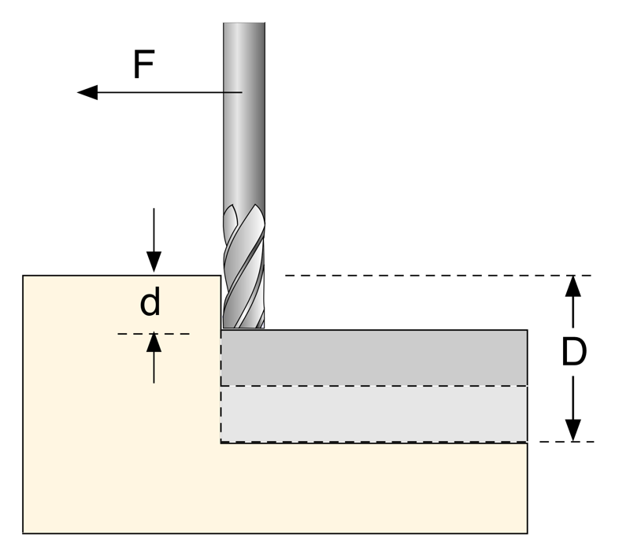

DOC is just as important as feeds & speeds to achieve a good cut, yet surprisingly there is much less information about how to determine its value, compared to the abundance of feeds and speeds charts.

The reason is probably that while there are mathematical recipes to choose feedrate and RPM for a given endmill geometry, the achievable DOC is much more tightly linked to the specific machine you are using, and specifically its rigidity and power.

The Carvera is not as rigid nor as powerful as industrial CNC machines, so DOC recommendations for these machines need to be dialed back, even when using perfect feeds and speeds.

There is a strong dependency between DOC and WOC: since cutting forces increase with both DOC and WOC, you cannot cut very deep while using a very large stepover, that would put too much effort on the endmill. So the two choices are:

* large WOC but small DOC
* small WOC but high DOC

These two situations are illustrated below:

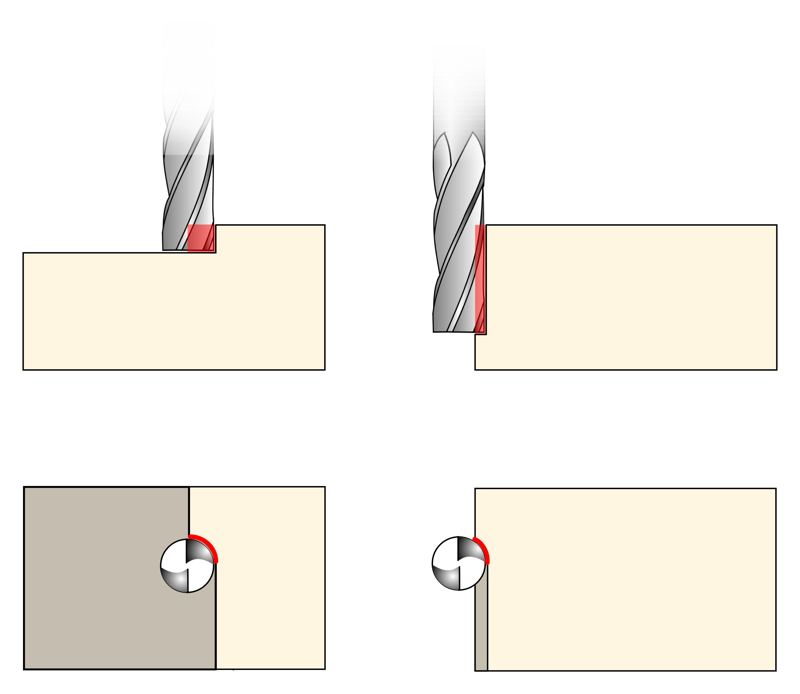

The _**small WOC, high DOC**_ approach is much preferable, as it spreads the heat and tool wear much more evenly along the length of the endmill. However, it requires specific toolpath strategies (_e.g._ to initially clear material down to the required depth, to allow small WOC to be used for the rest of the cut), this is covered in the [Toolpaths](toolpath-basics.md) section. This is a very popular approach when cutting metals on the Carvera, but its benefits apply to other materials too.

The _**large WOC, small DOC**_ approach only ever uses the tip of the endmill, so that part will wear out quickly while the rest of the endmill length of cut remains unused. But it is still a very common approach for pocketing and profile cuts on the Carvera, and it has simplicity going for it.

Unlike chiploads that NEED to be in a specific range to get good cuts, the situation is easier for DOC and WOC: you can just start with small, conservative values and then increase them to find the limit for your machine/endmill/material combination.

## Slotting

Depending on the stepover, the portion of the endmill that will be engaged in the material, a.k.a. the Tool Engagement Angle (**TEA**), will be different:

For a 50% stepover, the TEA will be 90°:

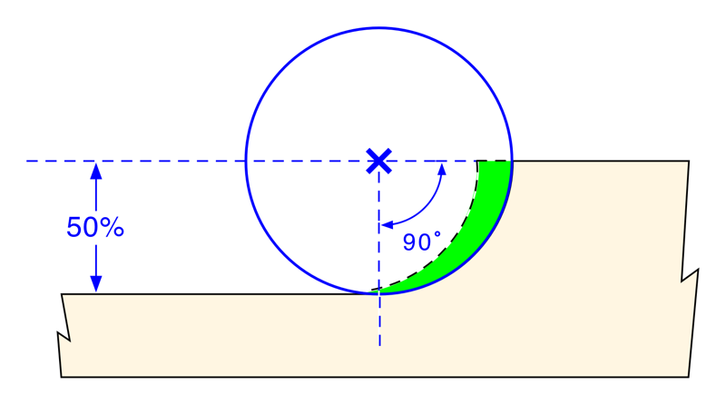

For a smaller stepover, say 25%, the TEA will be reduced (in this case to 60°):

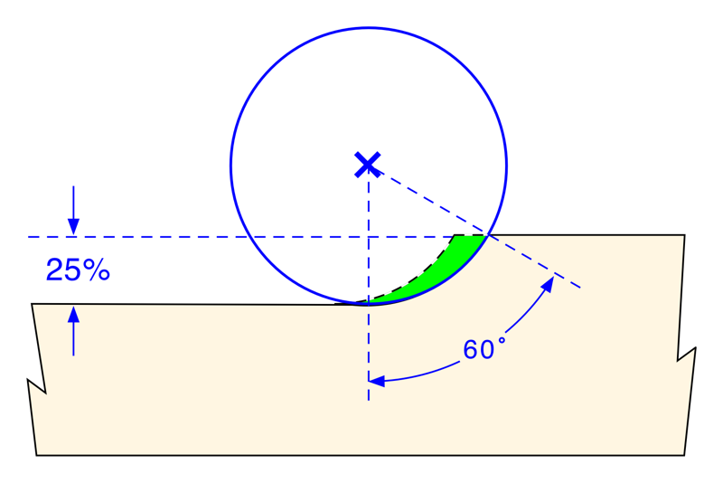

**Slotting** is a different story: half of the endmill is engaged at all times, so the TEA is 180°:

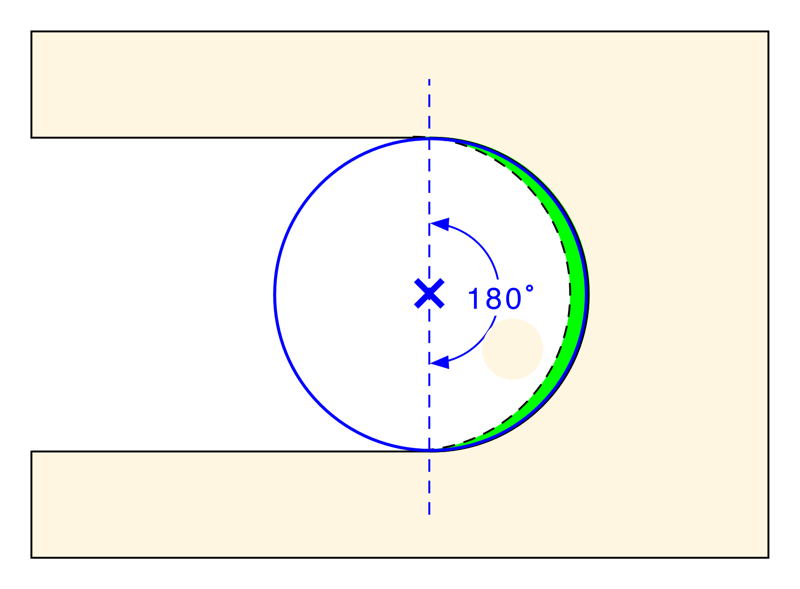

The force on the endmill will be much higher than when cutting at 90° TEA, so the max achievable chipload/DOC combination for a given machine/endmill/material is lower. The recommended chipload/DOC values mentioned above include some margin to take this effect into account to some extent.

The other side effect of slotting is that chip evacuation is not as good: the flutes are in the air only 50% of the time, so the chips that form inside them have less time/fewer opportunities to fly away. Deep slotting is notorious for causing issues when chips cannot be evacuated quickly enough.

Bottomline: slotting is hard on the machine, so you may have to:

* limit DOC to the low end of the range of values
* limit feedrate (chipload...)
* optimize chip evacuation by using an endmill with a lower number of flutes, and/or a good dust shoe or blast of air


Or, you can take a different approach and _avoid_ slotting altogether, by using smarter toolpaths. See adaptive clearing and pocketing in the [Toolpaths](toolpath-basics.md#adaptive-clearing-toolpaths) section!


Not that you will ever need to use it, but for the math-inclined among you, here's the equation to compute TEA from stepover value:

$$
TEA = \cos ^{ - 1}(1 - \frac{stepover}{0.5×endmill\_diameter})
$$

## Corners

While we are talking about TEA, let's take a look at what happens when cutting a square pocket at 50% tool engagement (90° TEA) and reaching a corner:

Just before moving into the corner, the tool engagement angle is 90°:

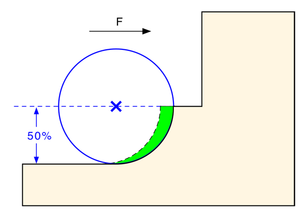

But _while_ cutting the corner, the TEA momentarily goes up to 180°:

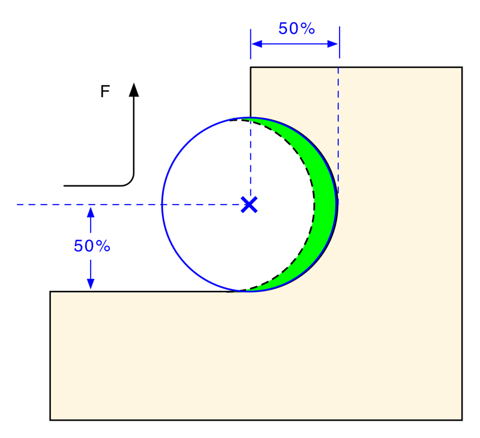

before going down to 90° again. So the machine sees a "spike" in the cutting resistance at each corner. Just like for slotting, this means that the feedrate and DOC cannot be as high as one would like, since they need to be dialed back a bit to manage corners. In many advanced CAM programs there are provisions to detect when this corner dig in happens. In Fusion it is called Feed Optimization


This boils down to optimizing the cut parameters used throughout the job specifically for these very short times when the corners are being cut, which is not very efficient. The alternatives include avoiding straight corners in the design if possible (_e.g._ round the corners...) or use an **adaptive clearing toolpath** that will take a lot of very shallow bites at the corners instead of a deep one.


## Plunge rate

All of the info above only focused on the feeds and speeds for the radial part of the cut, but when the endmill is plunging (straight down/vertically), things are quite different:

* (obviously) the cutting edges on the circumference of the endmill are not cutting anything anymore, the cutting happens at the tip of the endmill only, like a drillbit.
* BUT endmills are really not optimized for drilling, so their ability to plunge efficiently through material is quite limited.
* There are alternatives to plunging with endmills such as ramping strategies or starting from off the edge of the part which are often much better than plunging.&#x20;

One could compute specific plunge rate and RPM based on the specific geometry of the tip of the endmill, but in practice it's easier to just use a plungerate that is experimentally chosen, following the rule of thumb

* **10% to 30%** of the feedrate for metals
* **30% to 40%** of the feedrate for woods
* **40% to 50%** of the feedrate for plastics (plunging fast is required to avoid melting)


These numbers are for plunging straight down. If the toolpath uses some ramping at an angle into the material, they can be increased quite a bit.


## Tool deflection

Endmills are not infinitely rigid, they tend to bend (deflect) when submitted to the cutting forces, and that deflection needs to be taken into account in the feeds and speeds. Here is a grossly exaggerated sketch of an endmill being subject to the cutting force:

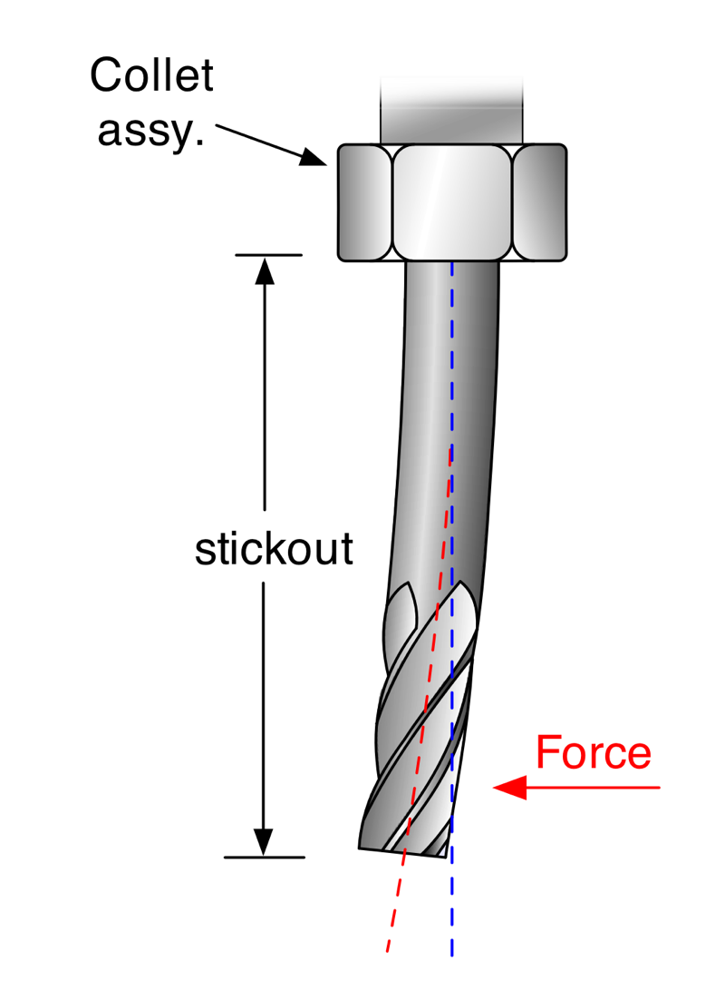

The amount of deflection depends on the endmill material (carbide is more rigid than HSS), diameter (larger is stiffer), stickout length, and of course the cutting forces that the endmill is subjected to, that depend on the chipload, DOC, WOC, and material.

When using conventional milling, the force tends to be parallel to the stock:

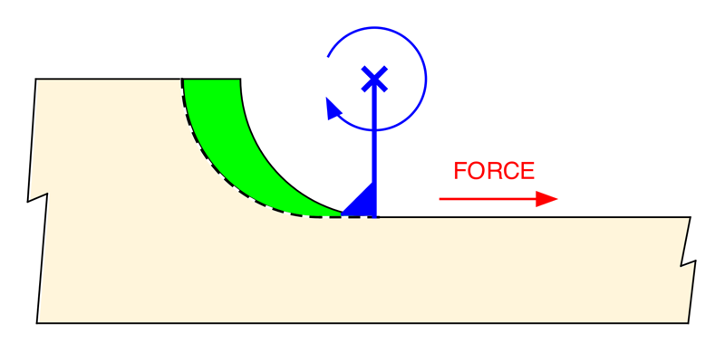

When using climb milling, the force tends to be perpendicular, i.e. push the endmill away from the material:

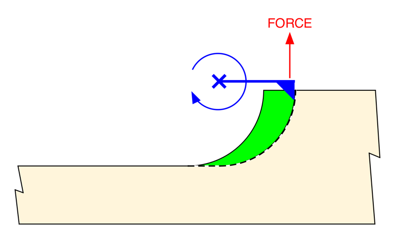

Either way, too much deflection is bad:

* moderate deflection will affect accuracy (pieces will cut slightly larger or smaller than expected)
* excessive deflection will cause tool wear or even tool breakage
* deflection on small WOC motions can prevent the endmill from actually cutting into the part and instead just rubbing against it.&#x20;

So this is yet another parameter to watch out for when selecting feeds and speeds and DOC/WOC values, especially when using small diameter endmills.

## Climb or conventional ?

The direction of the cut (climb versus conventional milling) pertains to the toolpath's generation options and not directly to the feeds and speeds, but while we are on this topic: since tool deflection is mainly perpendicular to the cut when using climb milling, it would seem like it is better to use conventional milling, to keep deflection parallel to the cut and therefore minimize dimensional errors on the final piece. However there are other factors at play:

* in conventional milling, the chip is cut from thin-to-thick, so by definition when the flute first comes in contact with the material, it is rubbing the surface a little before it starts actually cutting into the material. This temporary rubbing amounts to heat, so in the long run a conventional cut produces more heat, leading to faster tool wear. Climb milling, since it cuts chips from thick-to-thin, does not have this problem.
* for the same "thick-to-thin" reason, climb milling is a little more tolerant of less-than-perfectly-sharp endmills.
* in conventional milling, the cutter flutes move against the direction of the feedrate, so chips are more likely to be pushed to the front of the cut, leading to chip recutting which is bad for finish quality. In climb milling, the chips tend to be pushed to the back of the endmill / behind the cut, so they are much less prone to recutting.
* in climb milling, the spindle torque pushes in the same direction as the feedrate, while in conventional it fights against the feedrate, so the forces on the stepper motors are higher.
* climb milling used to have a bad reputation for being dangerous to use on machines with a lot of backlash. While this was perfectly true on older manual mills, the point is moot on CNCs in general and the Carvera in particular.

So when all is said and done, climb milling wins on almost every aspect except deflection. The [Toolpaths](toolpath-basics.md#roughing-vs-finishing-toolpaths) section will cover the notion of "roughing" versus "finishing" toolpaths, and that will then open the way for the best approach: using **climb for roughing, then conventional for finishing**.

This way, climb and its many advantages is used for most of the cut, and the possible deflections happening during this roughing pass will be taken care of by the light conventional finishing pass (where the drawbacks of conventional will be irrelevant, since this finishing pass puts such low efforts on the machine anyway, and chip evacuation is not a problem either)

## MRR, Power, Torque

If you need to optimize **cutting time** for a given piece, you will also need to take a look at the **material removal rate** (MRR):

$$
MRR = WOC × DOC × Feedrate
$$

This yields a value in cubic inches (or cubic millimeters) of material removed per minute, and therefore relates to how fast you can complete a job. There is always a compromise to be found between going faster but with a lower tool engagement (low DOC and/or low WOC), or going slower but with a higher tool engagement (higher DOC or high WOC), while staying within the bounds of what the machine can do. The interesting thing about the MRR figure is that it allows one to **compare** different combinations, and figure out which one is the most efficient (time-wise).

Now if you want to figure out how close you are to the absolute/physical **limits** of the Carvera, (yet) another formula comes in the picture, to characterize the required power at the endmill level to achieve this MRR:

$$
Cutting \ power\ (in\ HP\ unit)= \frac{MRR}{K\_factor} = MRR × Unit\ Power
$$

the "K" factor (or its inverse value the Unit Power) is a constant that depends on the material's hardness, and corresponds to how many cubic inches per minute (or cubic millimeters per minute) of material can be removed using 1 horsepower.

For example,

* 6061 T6 aluminium has a K of 3.34 cubic inches per minute
* it's about 10 in³/min for hard woods and hard plastics
* and up to 30 in³/min for soft woods, MDF, ...

Once you get this power value, you can compare it to the spindle's maximum output power. The Carvera spindles are rated at a max of 200 watts, but that is _input_ power, so this needs to be adjusted by the motor efficiency, power lost due to bearings and in the case of the original Carvera also drivetrain loses due to the belt based gearing. So the max actual power at the cutter is more likely around 75W for the Carvera and 100w for the Carvera Air.

## Telltale signs of wrong F\&S

The most common signs of inadequate feeds and speeds are:

* sound, and specifically **chatter**: when feeds and speeds are not right for a given material/endmill/DOC/WOC, the tool tends to vibrate, and this vibration can get worse if there is resonance with another source of periodic variation elsewhere in the system (most often: the spindle motor and its RPM). This results in an ugly sound, a poor finish with marks/dents/ripples on the surface, and a reduced tool life.
* **finish quality**: even without chatter, a poor surface finish can indicate that the final cutting pass was too agressive (too much chipload or too much deflection). Increasing RPMs may help, but the best approach is to use a finish pass with very low WOC.
* **melted material**: especially in plastics and soft metals like aluminium, if the feedrate is too low for the selected RPM, the friction will cause the material to melt rather than shear, the tool flutes will start filling with melting material, and this usually ends up with tool breakage. You will need to feed faster, and/or use an endmill with a lower flute count.
* **endmill temperature**: the endmill should not be more than slightly warm at the end of a cut: if it gets hot to the touch (careful!), the feeds and speeds are likely incorrect (too low or too high chipload), or the tool is dull and is rubbing rather than cutting. In extreme cases, the endmill color itself may change to a dark shade.
* making **dust**, instead of clearly formed chips is an indication that chipload is probably too low (MDF is an exception, you just cannot get chips anyway with this material)
