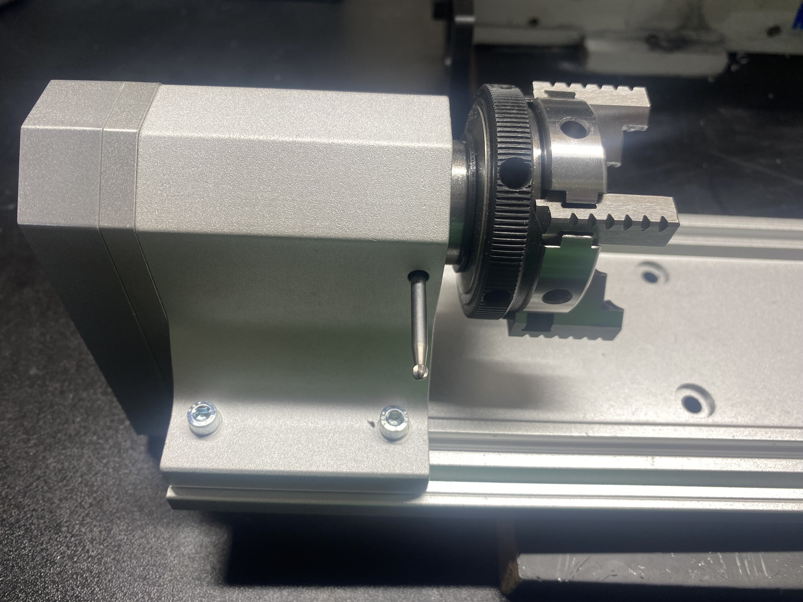
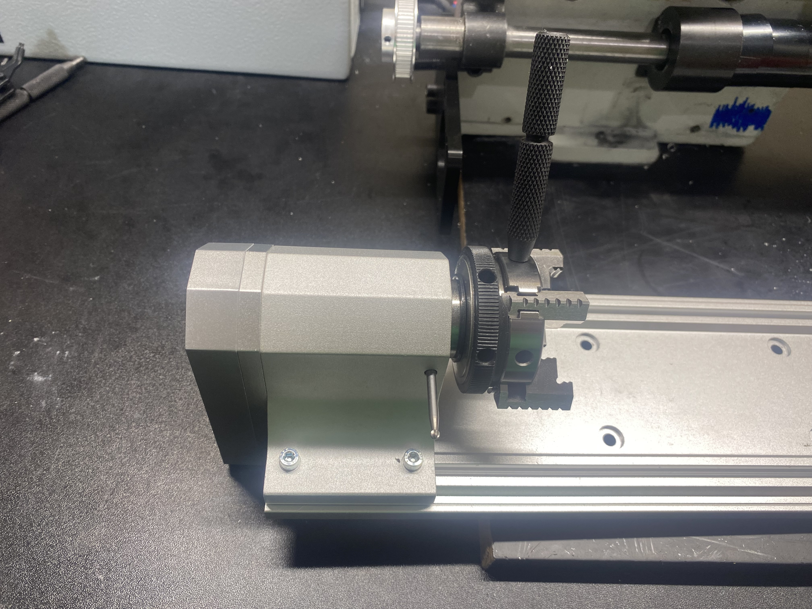
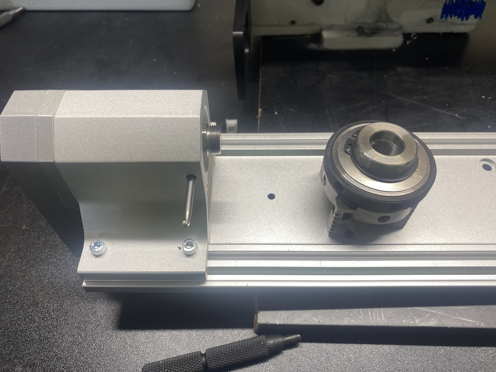

# 4th Axis: Removing the Chuck

You can remove the chuck from the fourth axis to expose an M14-1 threaded headstock. To increase holding power/accuracy you can thread your part directly onto this thread, or thread on other accessories.



## Lock chuck rotation

You will need a 3.175mm (1/8") ground pin to remove the chuck. Look into the hole on the side of the headstock and turn the chuck until you see an indent through the hole. Fully seat the ground pin into this hole, the headstock should no longer move.

<figure><figcaption></figcaption></figure>



### Unscrew chuck

Using one of the chuck wrenches as shown, gently unscrew the chuck. Counter clockwise

<figure><figcaption></figcaption></figure>



### Carefully remove chuck

Be sure not to drop the chuck when it comes off.

<figure><figcaption></figcaption></figure>



### Reinstallation

Reverse these steps to reinstall the chuck/install a different accessory. Before threading anything onto the headstock, be sure that the internal and external threads are very clean. Any chips in here will lead to misalignment/could damage your headstock. It should thread on easily by hand until you tighten the final amount with the wrench.&#x20;

If you need to apply a lot of force you are probably cross threading and could ruin your headstock and chuck. A trick is to start turning the chuck counterclockwise as if you are unscrewing it first. As you press it onto the threads while turning, you can feel a slight click, denoting that you have found the start of the thread. Then try tightening.


