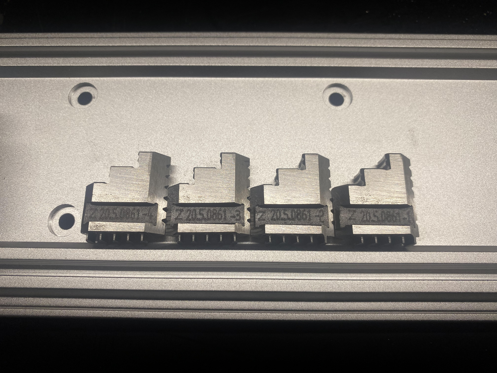

# 4th Axis: Reversing the Chuck Jaws

The chuck jaws on the stock Carvera 4th axis chuck are reversible to allow you to either hold a smaller part more securely, or a larger part. Below are the two options for holding stock with the chuck jaws.

<figure><figcaption>
Use this configuration to hold onto larger parts
</figcaption></figure> <figure><figcaption>
Use this configuration to hold smaller parts more securely
</figcaption></figure>

To change the orientation of the chuck jaws, follow these steps:



### Release the chuck jaws

Use the two chuck wrenches (sometimes called tommy bars) to back out the chuck jaws all the way. As they near the edge of the chuck they may become a bit tight. Do not use excessive force to turn the chuck at this point, instead you might have to work the wrenches back and forth/manually adjust the jaws with your fingers to get them to come off.

<figure><figcaption></figcaption></figure>



### Note slot used for the jaws

The jaws will come out of the chuck one at a time, in order around the chuck. You might get a more accurate results out of the chuck with the jaws in a particular set of slots. A common practice with chucks is to mark which slot gets jaw 1. Since the jaws are reversible, you might have different marks for the different jaw orientation.



### Jaws numbering

Once the jaws are out of the chuck take a moment to clean everything up to remove any chips in the mechanism, add some light machine oil to the spiral and chuck jaw sides, and take note of the numbering on each of the jaws. The last number denotes the order in which the jaws get installed.

<figure><figcaption></figcaption></figure>



### Reinstall the jaws

Using the chuck wrenches, move the start of the spiral thread to just before the 1st slot you wish to add a jaw. From this point you will be adding the jaws in order from 4 to 1 for the larger clamping setup, or from 1 to 4 for the smaller clamping setup.&#x20;

* &#x20;For the larger clamping setup: Add jaw 4 to the indicated slot, turning the chuck wrenches to grab onto the first thread on the back of the jaw. Keep turning gently until the spiral thread is just before the next slot in the line (you might have to wiggle the jaws/back off on the chuck wrenches to get them to seat correctly). Continue adding the remaining jaws in the order 3 - 2- 1.&#x20;
* For the smaller clamping setup: Add jaw 1 to the indicated slot, turning the chuck wrenches to grab onto the first thread on the back of the jaw. Keep turning gently until the spiral thread is just before the next slot in the line (you might have to wiggle the jaws/back off on the chuck wrenches to get them to seat correctly). Continue adding the remaining jaws in the order 2 - 3 - 4.&#x20;

<figure><figcaption></figcaption></figure>



### Check the center

Close the chuck all the way to make sure that the jaws meet at the center. If they do not, you may have accidentally skipped over grabbing a particular jaw or installed them in the wrong order.


