# Cutters & collets

It's easy to be overwhelmed at first by the variety of cutters and their characteristics. Roughly, an endmill is characterized by:

* its **type/geometry,** which relates to its intended use:
  * **square** endmills are used for cutting flat surfaces _e.g._, pocketing and contouring, and for removing material quickly \(roughing\).
  * **ballnose** endmills are typically used for milling 3D surfaces.
  * **V-bits** are used to carve variable-depth grooves based on a 2D feature.
  * several other types are covered below but may require specific CAM features.
* the **diameter of its shank** \(the part that goes in the collet/tool holder\)
  * a large shank is better for reducing deflection.
  * the choice of shank diameter is constrained by the available collets.
* the **diameter of its cutting part**
  * the most common sizes used on the Shapeoko are 1/4'' \(6.35mm\), 1/8'' \(3.175mm\), 1/16'' \(1.5875mm\), and 1/32'' \(~0.8mm\), and their metric cousins \(6, 3, 2, and 1mm\).
  * the smallest feature size in a design determines the smallest endmill diameter needed.
  * smaller endmills are more fragile and more sensitive to runout \(more on this below\).
* the **length of its cutting part \(**Length of cut / **LOC\)**, and its overall length \(**OAL**\).
  * a short LOC is better for stiffness, but obviously constrains the max depth of cut.
  * a long OAL provides better reach, at the expense of rigidity/deflection.
  * On the smallest diameter endmills, the cutting length is really short otherwise the tool would be extremely fragile and deflect too much
* the **number of flutes** \(number of cutting teeth\)
  * see [Feeds & speeds](feeds-and-speeds-basics.md) for the impact of the number of flutes.
  * fewer flutes are better for chip evacuation.
  * more flutes are better for stiffness and finish.
* the **material** it is made of:
  * **carbide** is king these days for CNC milling, but it is brittle.
  * **high speed steel** \(HSS\) is cheaper and tougher, but more limited in speeds.
* its **coating**, if any:
  * Generally, no coating is needed for cutting wood and plastics.
  * **ZrN** \(Zirconium Nitride\) coating is good for non-ferrous metals _e.g._, aluminium, brass, copper, titanium.
  * **AlTiN** \(Aluminium Titanium Nitride\) coating is good for steel/ferrous-metals.
* whether it is **center cutting** or not:
  * most are, it means they have the ability to plunge into the material \(vertically\), like a drill bit does.
  * non-center cutting tools are more commonly used on manual power tools, think router bits. It is _possible_ to use them on a Shapeoko, but it requires a very careful CAM design.
* the **helix angle**, if it's a spiral endmill:
  * depending on the helix angle, cutting forces will be oriented differently between the axial and radial directions: it's not really something you should worry about.
* the **direction** of rotation
  * in practice virtually all endmills are designed for a **clockwise** tool rotation \(as seen from above the cut\)

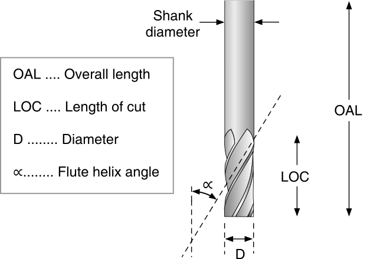

## Square endmills

**Square** endmills are ****the workhorses of CNC milling. They come in several variants:

* **upcut**: the direction of the flute spiral is such that it pulls chips away from the cutting surface, thus is quite efficient at evacuating chips. It will produce a nice finish at the bottom of pockets, but can produce tear out on the top edges in some materials.
* **downcut**: it pushes chips downward when cutting, so is not efficient to evacuate them from the cutting area. It tends to do the opposite as an upcut, i.e. leaving produce a clean cut at the top edges of the cuts, but potential tear out at the bottom of pockets.
* **compression**: the flute geometry is such that it combines an upcut section at the bottom of the tool, and a downcut section at the other end of the cutting part, so for certain pocket depths it can give a nice finish both at the bottom and top of pockets.

Here's an example for a 3-flute, 1/4'', upcut square endmill \(codename "\#201" on Carbide 3D store\)

It also comes in a version coated with zirconium nitride \(ZrN\) which minimizes the risk of sticking when cutting non-ferrous metals:

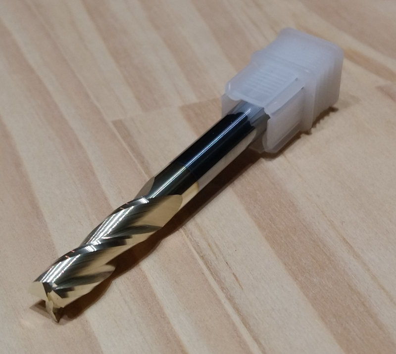

Here's an example of a 1/4'' endmill with only 2 flutes:

and here's a 1/4" one with a single flute \(a.k.a. "O-flute"\), that provides excellent chip evacuation:

**Downcut** endmills have their helical flute\(s\) oriented the other way, as in this 1/4'' 1-flute downcut:

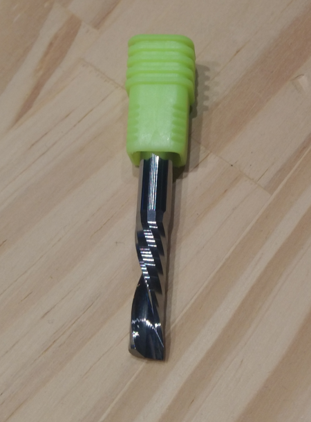

Here's another downcut, 2-flute, 1/8'' endmill:

And then there are the funny looking **compression** endmills, that start with an upcut section at the tip, and have a downcut section higher up the shaft, here's a 1/4'', 2-flute version:

and a smaller 1/8'', 1-flute compression endmill:

## Corner radius endmills

Square endmills have a weak point, and that's the sharp tip of each of their flutes. In demanding materials \(like metal\) this is likely to chip, so one can use **corner radius** \(a.k.a. "bullnose"\) endmills instead: they behave very similarly to square endmills, but are much less prone to chip at the tip, hence can be used at more aggressive settings. Notice in the two pics below, the rounded corners \(top: TiCN-coated, bottom: ceramic-coated\)

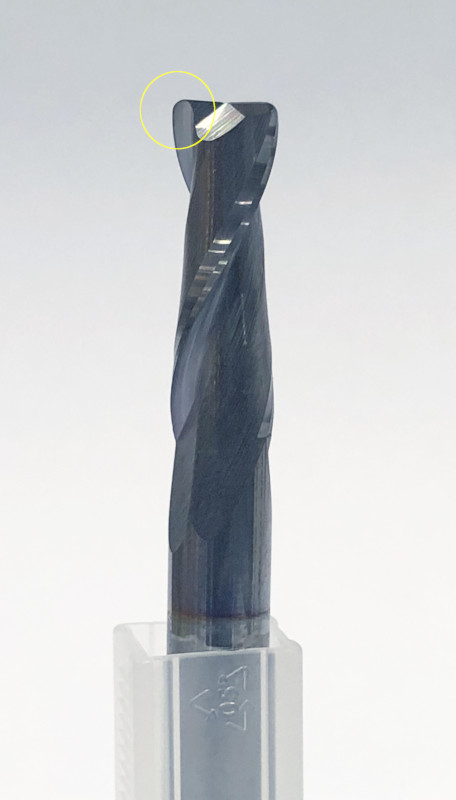

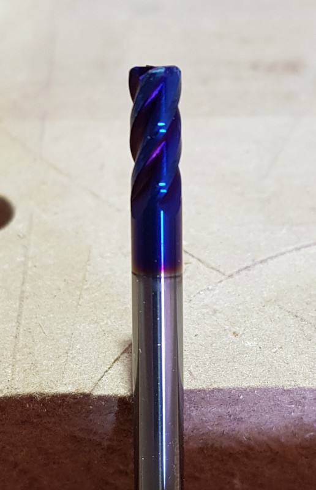

## Ballnose endmills

Ballnose ****endmills are better suited for machining smooth 3D curves \(but are quite inefficient for machining flat pockets\), here's a 2-flute 1/4'' ballnose:

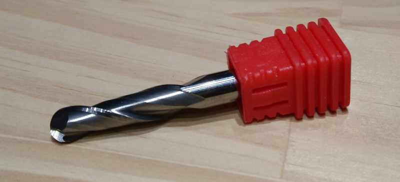

Here's a 0.032'' ballnose:

For carving fine 3D details, a **tapered** ballnose endmill can be very useful: the tip can be very small, but the tapered flutes make it much more robust than a straight endmill of the same tip diameter, so it can support much more aggressive feeds and speeds. Here's a tapered endmill with a 0.5mm \(0.02''\) ballnose tip:

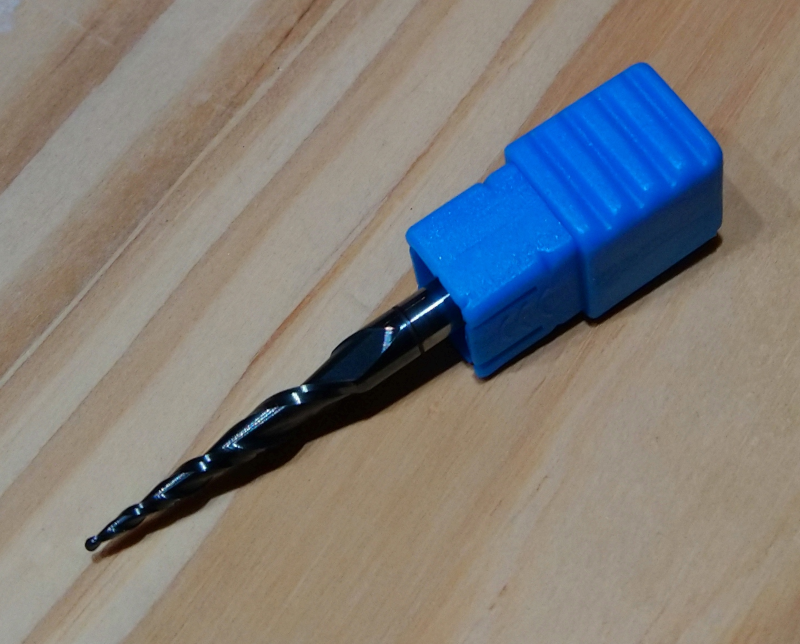

## **V-bits**

V-bits come with various angles, they are typically used to carve text or tiny grooves \(more on this in the [Toolpaths](toolpath-basics.md#v-carving-toolpaths) section\):

## Surfacing bit

They usually have a very large diameter, to be able to surface a wide area in one \(very shallow\) pass:

## Engraving bit

Another specialized bit is used for ****engraving ****very small details, it's basically a very pointy one, and can be used for example to carve very narrow tracks on the top of a copper-clad PCB.

## Diamond drag bit

The diamong drag bit has a tiny diamond on its tip, and is intended to be dragged across the surface of the material \(with the router TURNED OFF!\) to engrave a 2D pattern on the surface. The tip is usually spring-loaded, so that the tip is always in contact with the surface with a controlled pressure, while the bit moves around:

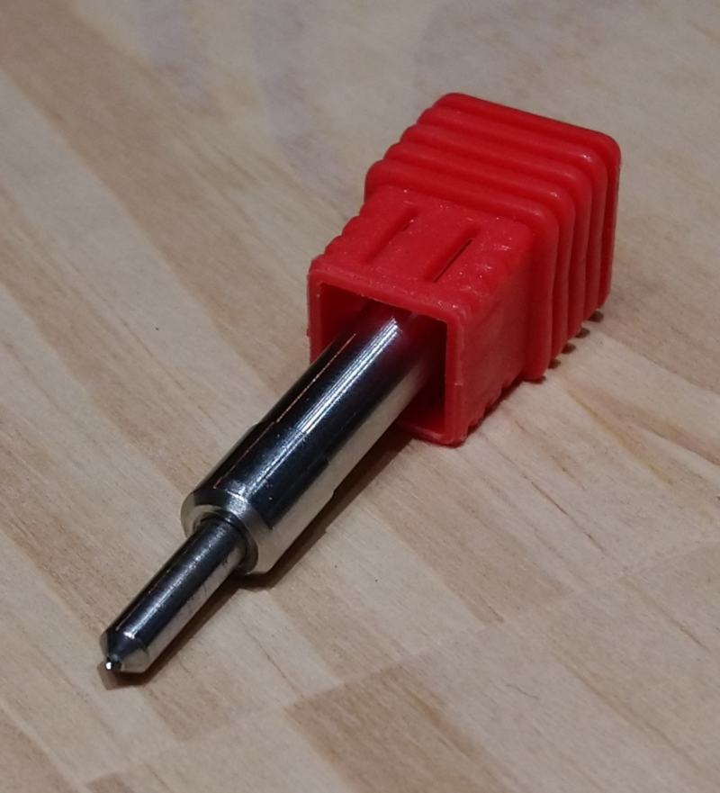

## Thread milling bit

Special thread milling bits are used in conjunction with very specific spiral toolpaths, to thread the inside of a hole:

And there are many more, but these should cover a large part of the usecases/projects.

## Collets

There is not much too say about collets, other than "they come in various sizes and quality". Here's a sample set of collets for the Makita router:

From left to right:

* 1/4'' Makita collet \(comes with the router in the US version\)
* 6mm Makita collet \(comes with the router in the European version\) with a 6mm to 3.175mm adapter inserted
* 1/8'' \(3.175mm\) cheap unbranded collet
* 1/4'' \(6.35mm\) precision collet from Elaire Corp
* 1/8'' \(3.175mm\) precision collet from Elaire Corp


It is mandatory to use a collet size that matches the endmill shank diameter. Mistakenly using a 1/4'' \(6.35mm\) collet for holding a 6mm endmill will likely end badly, with the endmill slipping in the collet during the job. The wiggle of a 6mm endmill in a 1/4'' collet is hard to overlook, but beware.


Typical router collet sizes are 4 mm, 6 mm, 8 mm, 1/8'', 3/16'', 1/4'', 3/8'', so the range of available sizes is limited, especially toward the larger shank diameters. Spindle users have access to specialized collets such as the “ER”-style which has become an industry standard, that are available in many more sizes:

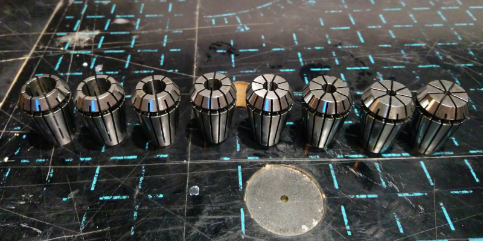

Using a **collet adapter/reducer** is generally not recommended as it tends to increase **runout**, but for most jobs it will still work fine.

Below is a short overview of what runout is, but overall this is not something new users have to worry about.

## Runout

Ideally, the rotation axis of the router shaft \(in black\), the axis of the collet \(in blue\), and the axis of the endmill \(in green\) are perfectly aligned:

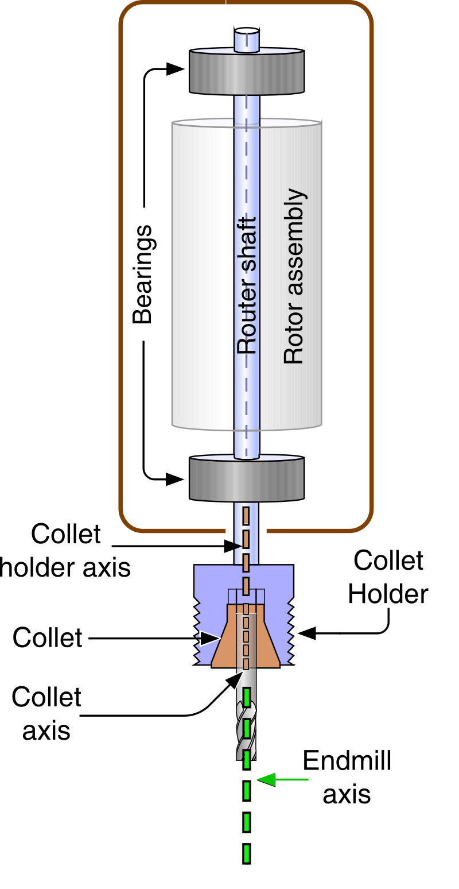

But in practice, manufacturing tolerances are such that there are small imperfections at all levels:

* the router shaft itself may not rotate perfectly on its axis
* the collet geometry may not be perfect, introducing a misalignment of the axis between the outer surface \(attached to the router shaft\) and the inner surface \(holding the endmill\)
* the endmill itself may not have a perfectly cylindrical shape

The end effect is that the movement of the endmill's tip in the material is the combination of the rotation along its own axis and other unintended deviations. Here's a very \(very\) exagerated view of what happens when cutting a single slot with a lot of runout:

The expected width of the slot is the endmill diameter, but the actual width of the slot \(effective cutting diameter\) is the sum of the endmill diameter and the amount of deviation \(runout\). This deviation can be characterized by the maximal displacement measured at a given position on the surface of the endmill as it rotates \(again, extremely exaggerated on the view below\):

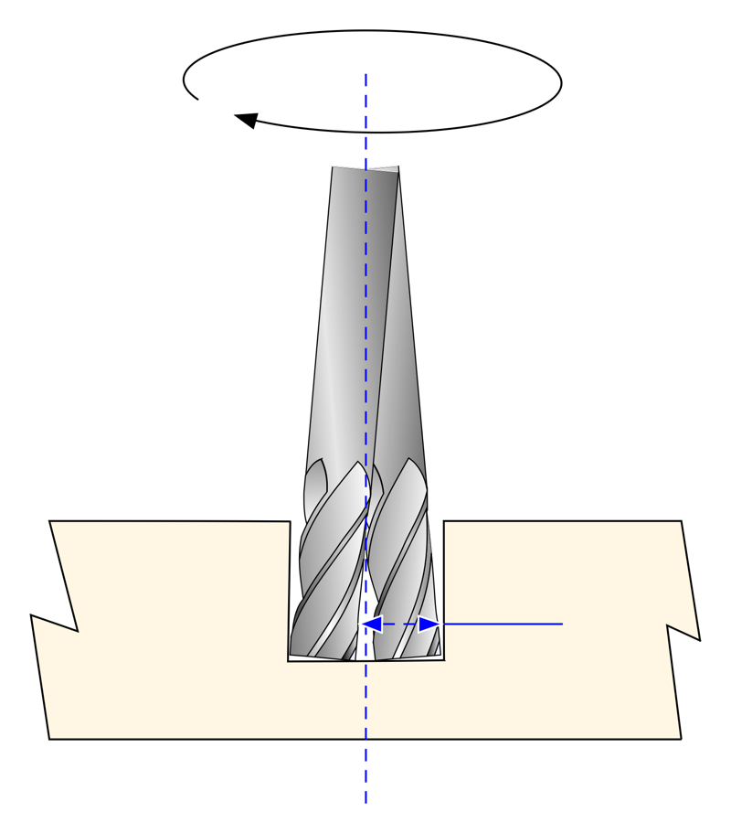

Refer to the runout section in [Dimensional accuracy](x-y-z-calibration.md#managing-runout) for details on how to measure runout, and correct it \(or at least take it into account\).

## Endmills & collets starter set

A common question when buying the Shapeoko is "which endmills and collets should I get?" 

* the answer of course is "it depends" \(on the nature of your projects\)
* the Shapeoko ships with a 1/4'' square endmill \(\#201 from Carbide 3D store\), and the router ships with a 1/4'' collet: this is enough to get started and make a lot of beginner projects actually.
* getting a couple of spare 1/4'' square endmills is a good idea: sooner or later, the original \#201 will wear out \(or chip, or even break in the event of a really big mistake\)
* the usual next step is to realize that 1/4'' is too large to cut small features: getting a couple of 1/8" square endmills will not go to waste anyway.
  * this comes with the need to get a 1/8'' collet, or at least a collet adapter. 
* if you intend to use 3D toolpaths and curvy surfaces, get a ballnose endmill \(1/4'' or 1/8'' or smaller depending on the size/precision of your target projects\)
* get one V-bit: V-carving is quite easy and satisfying, you will probably want to try it, and it's a very common way to engrave text. They come in different shapes \(angles\), the most common ones are 60 degrees and 90 degrees. Make sure you invest in a good quality V-bit, it makes a big difference \(while it is easier to get away with using cheap square endmills\) 
* if you intend to cut mostly plastics, do get an O-flute square endmill.
* if you intend to cut mostly aluminium, ZrN-coated endmills will help.
* a surfacing bit is useful to reduce the time for surfacing your wasteboard, but honestly not required in the starter set, a 1/4'' endmill will do fine.
* the other types are very specific, so unless you know you will need them for sure, they can wait. 

So my recommendation for a **starter pack** would be something like:

* 2 × 1/4'' square endmills \(2 or 3 flutes\) to complement the one that ships with the machine
* 1 × 1/8'' collet for your router \(or at least a collet adapter to fit 1/8" in the 1/4" collet\)
* 2 × 1/8'' square endmills \(2 flutes\)
* 1 × 60° V-bit 
* 1 × 90° V-bit
* \(optionally for 3D work\) 2 × 1/4'' ballnose endmills
* \(optionally for plastics\) 1 × O-flute 1/4'' square endmill + 1 × O-flute 1/8" square endmill
* \(optionally for aluminium\) a set of ZrN-coated 1/4'' and 1/8'' endmills

