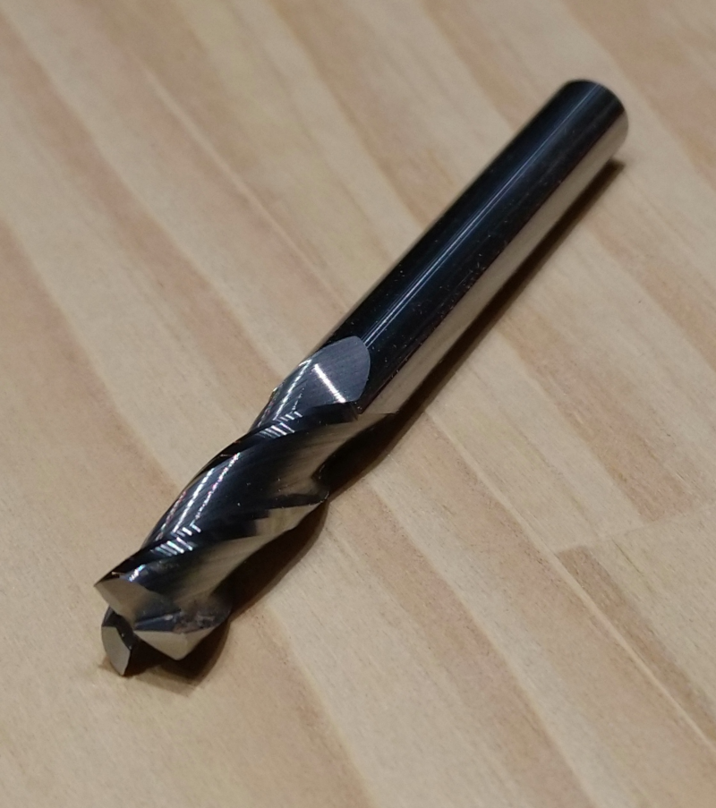
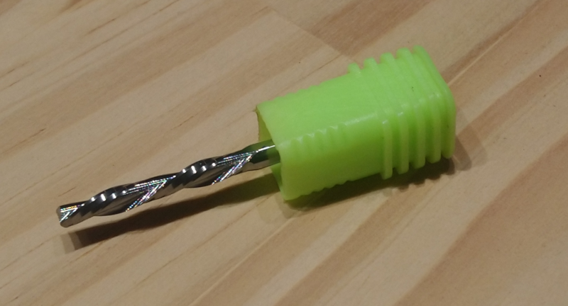
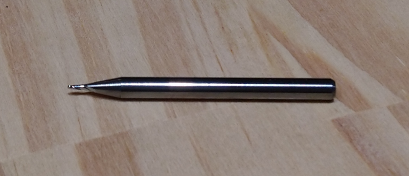
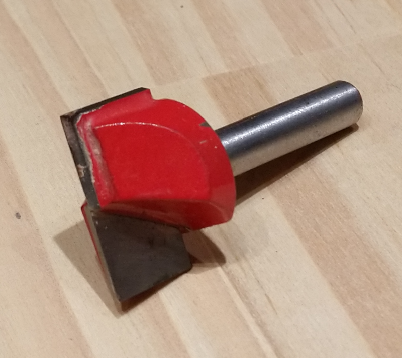
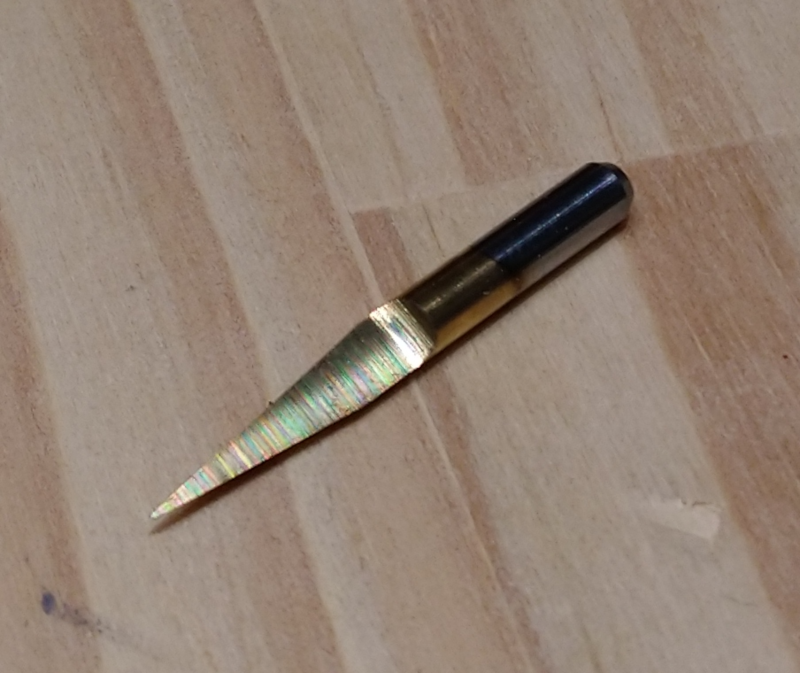

# Cutters

It's easy to be overwhelmed at first by the variety of tools and their characteristics. Roughly, an endmill is caracterized by:

* its **type** \(see below\)
* the **diameter of its shank** \(the part that goes in the collet/tool holder\)
* the **diameter of its cutting part**
* the **length of its cutting part \(**Length of cut / LOC**\)**, and its overall length \(OAL\).
* the **number of flutes** = number of cutting teeth
* the **material it is made of**, and its **coating** if any
* whether it is **center cutting** or not. Most are, it means it has the ability to plunge into the material \(vertically\), like a drill bit does.
* the **helix angle**, if it's a spiral endmill.

The most common endmills for the Shapeoko have a diameter of 1/4” \(6.35mm\), 1/8” \(3.175mm\), 1/16" \(1.5875mm\), and 1/32" \(~0.8mm\), with some additional metric sizes \(1,2,4, 6 and 8mm\)

**Square** endmill is ****the most common type

* **upcut**: the direction of the flute is such that it pulls chips away from the cutting surface, thus is quite efficient at removing chips. I will produce a nice finish at the bottom of pockets, but can produce tear out on the surface for some materials.
* **downcut**: pushes chips downward when cutting, so not efficient to evacuate them from the cutting area. It tends to do the opposite as an upcut, i.e. leaving produce a clean cut at the surface of the material, but potential tear out at the bottom of pockets.
* **compression**: the flute geometry is such that it combines an upcut section at the bottom of the tool, and a downcut section at the other end of the cutting part, so for certain pocket depths it can give a nice finish both at the bottom and top of pockets.

Here's an example for a 3-flute, 1/4", upcut square endmill \(codename "\#201" on Carbide3D store\)

It also comes in a version coated with zirconium nitride \(ZrN\) which is better to cut metals:

Here's an example of a 1/4" endmill with only 2 flutes:

and here's a 1/4" one with a single flute:

**Downcut** endmills have their flute\(s\) oriented the other way, as in this 1/4" 1-flute downcut:

Here's another downcut endmill, 2-flute, 1/8":

And then there are the funny looking **compression** endmills, that start with an upcut section at the tip, and have a downcut section higher up the shaft, here's a 1/4", 2-flute version:

and a smaller 1/8", 1-flute compression endmill:

**Ballnose** endmills are better suited for machining smooth 3D curves \(but are quite inefficient for machining flat pockets\), here's a 2-flute 1/4" ballnose:

On the smallest diameter endmills, the cutting length is really short \(otherwise the tool would be extremely fragile\), here's a 0.032"ballnose:

**V-bits** come with various angles, they are typically used to carve text or tiny groove \(more on this in the [Toolpath basics](toolpath-basics.md) section\):

Then there are even more specialized bits like **surfacing** bits that are aimed at...surfacing material. They usually have a very large diameter, to be able to cover a wide area in a few \(very shallow\) passes:

Another specialized bit is the **PCB engraving** one, it's basically a very \(very\) pointy one that can be used to make very thin traces on the top of a copper-clad board.

The **diamong drag** bit has a tiny diamond on its tip, and it intended to be dragged across the surface of the material \(with the router TURNED OFF!\) to engrave a 2D pattern. The tip is usually spring-loaded, so that the tip is always in contact with the surface with a controlled pressure, while the bit moves around:

Even more specialized: **thread milling** bits are used in conjunction with very specific spiral toolpaths, to thread the inside of a hole:

And there are many more, but these should cover a large part of the usecases/projects.

## Starter set

&lt;TODO guidelines to buy endmills to start&gt;

