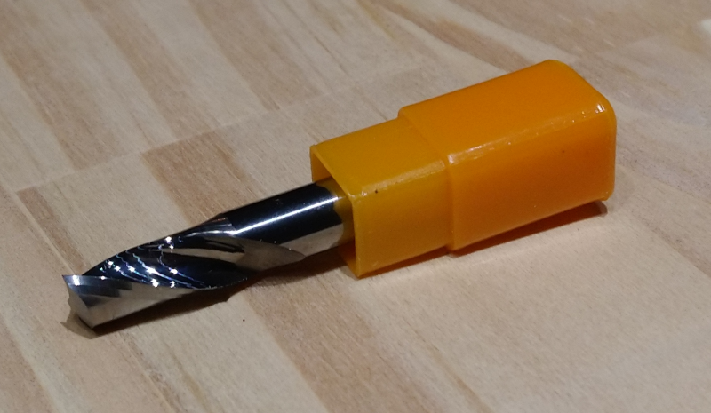
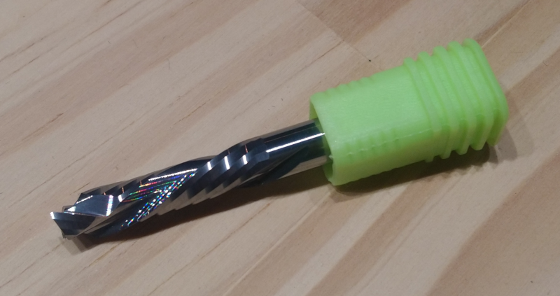

# Cutters & collets

It's easy to be overwhelmed at first by the variety of tools and their characteristics. Roughly, an endmill is caracterized by:

* its **type** \(see below\)
* the **diameter of its shank** \(the part that goes in the collet/tool holder\)
* the **diameter of its cutting part**
* the **length of its cutting part \(**Length of cut / LOC**\)**, and its overall length \(OAL\).
* the **number of flutes** = number of cutting teeth
* the **material it is made of**, and its **coating** if any
* whether it is **center cutting** or not. Most are, it means it has the ability to plunge into the material \(vertically\), like a drill bit does.
* the **helix angle**, if it's a spiral endmill.

The most common endmills for the Shapeoko have a diameter of 1/4” \(6.35mm\), 1/8” \(3.175mm\), 1/16" \(1.5875mm\), and 1/32" \(~0.8mm\), with some additional metric sizes \(1,2,4, 6 and 8mm\)

## Square endmills

**Square** endmill is ****the most common type

* **upcut**: the direction of the flute is such that it pulls chips away from the cutting surface, thus is quite efficient at removing chips. I will produce a nice finish at the bottom of pockets, but can produce tear out on the surface for some materials.
* **downcut**: pushes chips downward when cutting, so not efficient to evacuate them from the cutting area. It tends to do the opposite as an upcut, i.e. leaving produce a clean cut at the surface of the material, but potential tear out at the bottom of pockets.
* **compression**: the flute geometry is such that it combines an upcut section at the bottom of the tool, and a downcut section at the other end of the cutting part, so for certain pocket depths it can give a nice finish both at the bottom and top of pockets.

Here's an example for a 3-flute, 1/4", upcut square endmill \(codename "\#201" on Carbide3D store\)

It also comes in a version coated with zirconium nitride \(ZrN\) which is better to cut metals:

Here's an example of a 1/4" endmill with only 2 flutes:

and here's a 1/4" one with a single flute:

**Downcut** endmills have their flute\(s\) oriented the other way, as in this 1/4" 1-flute downcut:

Here's another downcut endmill, 2-flute, 1/8":

And then there are the funny looking **compression** endmills, that start with an upcut section at the tip, and have a downcut section higher up the shaft, here's a 1/4", 2-flute version:

and a smaller 1/8", 1-flute compression endmill:

## Ballnose endmills

Ballnose ****endmills are better suited for machining smooth 3D curves \(but are quite inefficient for machining flat pockets\), here's a 2-flute 1/4" ballnose:

On the smallest diameter endmills, the cutting length is really short \(otherwise the tool would be extremely fragile\), here's a 0.032"ballnose:

## **V-bits**

V-bits come with various angles, they are typically used to carve text or tiny groove \(more on this in the [Toolpath basics](toolpath-basics.md) section\):

## Surfacing bit

Then there are even more specialized bits like surfacing ****bits that are aimed at...surfacing material. They usually have a very large diameter, to be able to cover a wide area in a few \(very shallow\) passes:

## Engraving bit

Another specialized bit is used for ****engraving ****very small details, it's basically a very \(very\) pointy one, and can be used for example to carve very thin traces on the top of a copper-clad PCB.

## Diamond drag bit

The diamong drag bit has a tiny diamond on its tip, and it intended to be dragged across the surface of the material \(with the router TURNED OFF!\) to engrave a 2D pattern. The tip is usually spring-loaded, so that the tip is always in contact with the surface with a controlled pressure, while the bit moves around:

## Thread milling bit

Even more specialized: thread milling bits are used in conjunction with very specific spiral toolpaths, to thread the inside of a hole:

And there are many more, but these should cover a large part of the usecases/projects.

&lt;TO ADD: roughing endmills ?&gt;

## Collets

There is not much too say about collets, other than "they come in various sizes and quality". Here's a sample set of collets for the Makita router:

From left to right:

* 1/4" Makita collet \(comes with the router in the US version\)
* 6mm Makita collet \(comes with the router in the European version\) with a 6mm to 3.175mm adapter inserted
* 1/8" \(3.175mm\) cheap unbranded collet
* 1/4" \(6.35mm\) precision collet from Elaire Corp
* 1/8" \(3.175mm\) precision collet from Elaire Corp

The main constraint with router collets is that the range of available sizes is quite limited, especially toward the smaller diameters. Spindle users have access to "ER" collets that are available in many more sizes, but that is a story for the Spindle upgrade section.

Using a **collet adapter/reducer** is generally not recommanded as it tends to increase **runout**, but for most jobs it will still work fine.

Below is a short overview of what runout is, but overall this is not something new users have to worry about.

## Runout / TIR

In theory, the rotation axis of the router shaft \(in black\), the axis of the collet \(in blue\), and the axis of the endmill \(in green\) are aligned:

But in practice, manufacturing tolerances are such that there are small imperfections at all levels:

* the router shaft itself may not rotate perfectly on its axis
* the collet geometry may not be perfect, introducing a misalignment of the axis between the outer surface \(attached to the router shaft\) and the inner surface \(holding the endmill\)
* the endmill itself may not have a perfectly cylindrical shape

The end effect is that the movement of the endmill's tip in the material is the combination of the rotation along its own axis and other unintended deviations. Here's a very \(very\) exagerated view of what happens when cutting a single slot:

The expected width of the slot is the endmill diameter, but the actual width of the slot is the sum of the endmill diameter and the amount of deviation \(runout\). This deviation can characterized by the maximal displacement measured at a given position on the surface of the endmill as it rotates \(again, extremely exagerated on the view below\):

Refer to the section about [&lt;TODO link Managing runout](measuring-runout.md)&gt; for more.

## Endmills & collets starter set

A common question when buying the Shapeoko is "which endmills and collets should I get and how many of each ?". 

* The answer of course is "it depends" \(on the nature of your projects\)
* The Shapeoko ships with a 1/4" square endmill \(\#201 from Carbide3D store\), and the routers ship with a 1/4" collet: this is enough to get started and make a lot of beginner projects actually.
* Getting a couple of spare 1/4" square endmills is a good idea: sooner or later, the original \#201 will wear out \(or chip, or even break in case of a really big mistake\)
* The usual next step is to realize that 1/4" is too large to cut small inside features: getting a couple of 1/8" square endmills will not go to waste anyway.
  * this comes with the need to get a 1/8" collet, or at least a collet adapter. 
* If you intend to use 3D toolpaths and curvy surfaces, get a ballnose endmill \(1/4" or 1/8" or smaller depending on the size/precision of your target projects\)
* Get one V-bit: V-carving is quite easy and satisfying, you will probably want to try it, and it's a very common way to engrave text. They come in different shapes \(angles\), the most common ones are 60 degrees and 90 degrees. Make sure you invest in a good quality V-bit, it makes a big difference \(while it is easier to get away with using cheap square endmills\) 
* If you intend to cut mostly plastics, do get a O-flute square endmill.
* If you intend to cut mostly aluminium, ZrN-coated endmills will help.
* A surfacing bit is useful to reduce the time for surfacing your wasteboard, but honestly not required in the starter set, a 1/4" endmill will do fine.
* the other types are very specific, so unless you know you will need them for sure, they can wait. 

So my recommandation would be something like:

* 2 x 1/4" square endmills \(2 or 3 flutes\) to complement the one that comes with the machine
* 1 x 1/8" collet for your router \(or at least a collet adapter to fit 1/8" in the 1/4" collet\)
* 2 x 1/8" square endmills \(2 flutes\)
* 1x 60° V-bit 
* 1 x 90° V-bit
* \(optionnally for 3D\) 2 x 1/4" ballnose endmills
* \(optionnally for Plastics\) 1 x O-flute 1/4" square endmill + 1 x O-flute 1/8" square endmill
* \(optionnally for Aluminium\) a set of ZrN-coated 1/4" endmills

