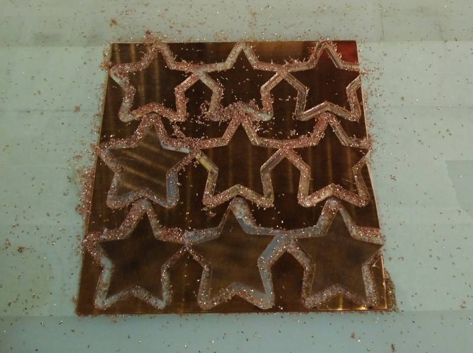

# Usecases: cutting metal

## Profile cuts in copper

The following is just a little experiment around doing profile cuts in copper with a 2-flute 1/8" square endmill \(\#102Z from Carbide3D store\), to figure out which feeds and speeds would work. I used a 100mmx100mm \(~4"x4"\) piece of 0.9mm \(0.035"\) thick copper, and cut simple profiles at increasing chiploads, to find the sweet spot.

The toolpath is a single **slotting contour/profile** cut, which is not the best thing to do if you need a perfect finish, you should rather do a roughing cut followed by a light finishing cut to have perfect edges. But for the purpose of this test, it represents a worst case scenario \(slotting throughout the cut\).

* The first step is to determine an adequate target **chipload** for an 1/8" endmill in copper. The guideline in the [Feeds & speeds](feeds-and-speeds-basics.md#shapeoko-chiploads-guideline) section for aluminium is 0.0005" / 0.0127mm. Aluminium and copper are different, and their hardness varies with the specific type/temper used, but overall they both are in the 75-150BHN range, so assumed I could use the same target chipload \(since my copper sheet was of unknown origin, so I could not make any better informed decision\)
* **Stepover** does not apply this since is a slotting cut. Therefore **chip thinning** does not apply either
* I chose **12.000 RPM**, for the quiet and since cutting force is not going to be a problem for given the shallow cut
* To achieve the 0.0005" chipload at 12.000RPM with this 2-flute endmill, the **feedrate** needs to be 0.0005 x 2 x 12000 = 12ipm = 300mm/min
* **plungerate** should be low since this is metal AND I will not be using any ramping into the material, so around 30% of the feedrate should do, that's 100mm/min
* For **depth of cut** the guideline of 5 to 10% of endmill diamerter for metals, 5% of 1/8" is 0.00625" and 10% is 0.0125, I selected a middle value of 0.008" / 0.2mm
* **deflection** is not likely to be a problem for this shallow cut \(and GWizard tells me the deflection for those settings is actually 0.002mm for a 20mm stickout\)

I actually tested 9 feedrates : 200, 300, 400, 500, 600, 700, 800, 900, and 1000 mm/min


I did not use any coolant or blast or air for this cut, but it would be better to do so


All the cuts completed without issue, but:

* the 200, 300, and 400mm/min cuts were a bit noisy with hints of chatter during some passes
* it got better at 500mm/min
* 600mm/min was the best cut \(clean noise and clean cut\)
* 700 to 1000mm/min got increasingly noisy and rough.

For this specific test, 600mm/min i.e. a chipload of 0.001" / 0.0254mm seemed to be the best setting, but it also showed that there is a good margin of usable feedrates around this value.

## Profile cuts in aluminium

* Same 2-flute ZrN-coated 1/8" square endmill, \#102Z
* Material for this test is 2017 T6 aluminium.
* Again target **chipload** for an 1/8" endmill in aluminium is 0.0005" / 0.0127mm, I started from that. 
* Same **12.000 RPM** speed
* To achieve the 0.001" chipload at 12.000RPM with this 2-flute endmill, the **feedrate** needs to be 0.0005 x 2 x 12000 = 12ipm = 300mm/min
* **plungerate** should be low since this is metal AND I will not be using any ramping into the material, so around 30% of the feedrate should do, that's 100mm/min
* For **depth of cut** I tried the high end of the recommanded range, 10% of the endmill diameter, 0.012" / 0.3mm
* **deflection** is still very low, 0.001mm for a 20mm stickout
* Still a simple slotting toolpath, but I used linear ramping, and lead-in/lead-out options in VCarve.

Once the cut started, I could feel that the 300mm/min feedrate was a bit too low, so I gradually increased it until it sounded right using the G-code sender feed override, and ended up at +50%, i.e. 450mm/min.

