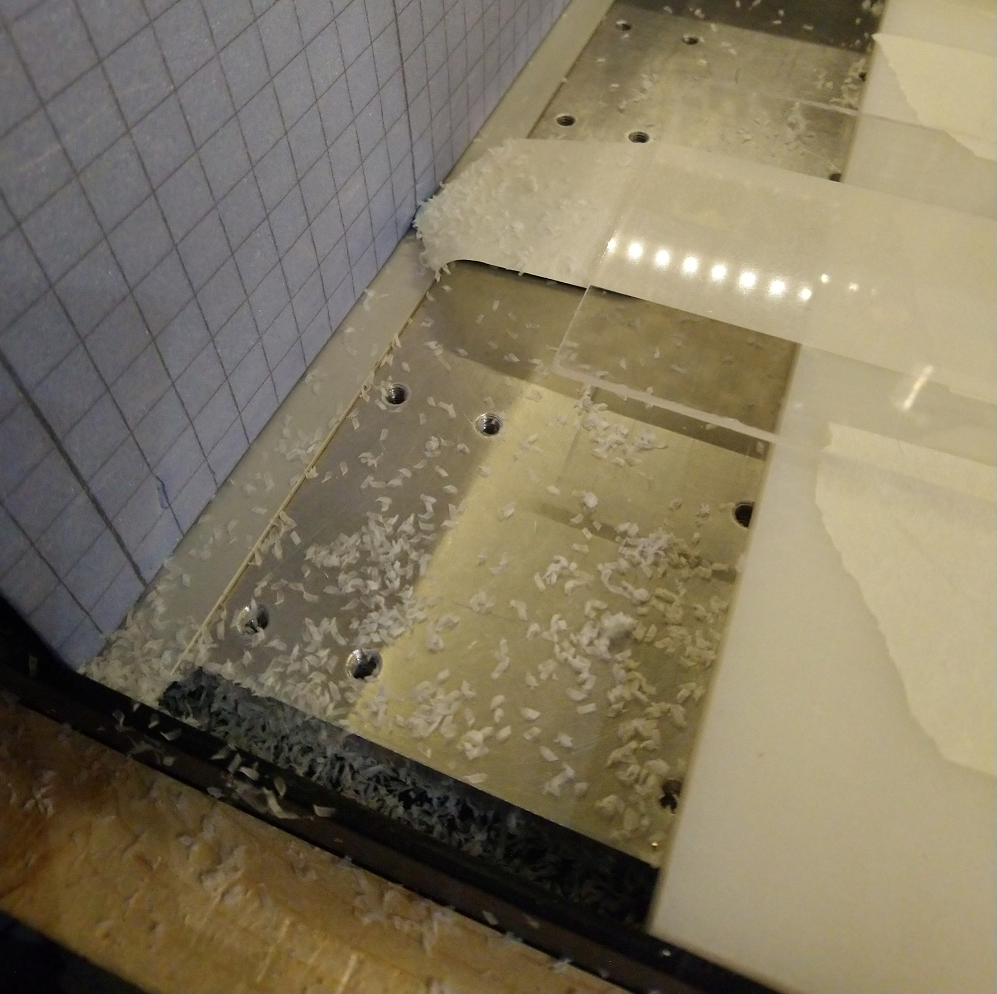
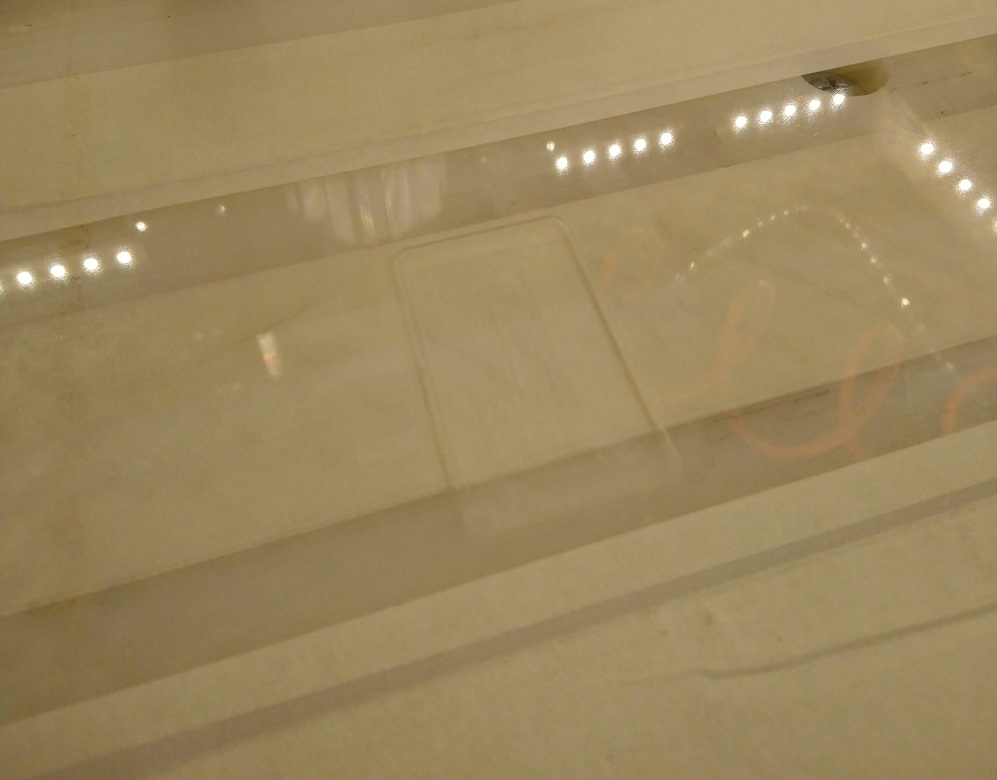

# Usecases: cutting plastics

Plastics are relatively easy to mill, but they are less forgiving than wood if feeds and speeds are not set to appropriate values. The reason is that plastic melts easily when heated, and since cutting forces produce heat...the name of the game is to evacuate heat as efficiently as possible.

This boils down to two things:

1\) ****Watch **the chipload:**

To ensure heat removal, you should either cut lots of thin chips very quickly \(i.e. use high RPM, and associated high feedrate maintaining chipload above 0.001"\), or cut thicker chips at lower RPM/feedrate.

If you are going for the high RPM option, a sharp cutter and a chipload of 0.002" should do the trick for most of the situations.

If you are going for low RPMs, then you should aim for the high-end of the recommended chipload range. As discussed in the [Feeds & speeds](feeds-and-speeds-basics.md#shapeoko-chiploads-guideline) section, for a 1/4" endmill in plastics, this is between 0.005"/ 0.13mm and 0.01" / 0.25mm. Such chiploads are hard to reach with 3-flute endmills. For example on the Dewalt router at its minimum RPM of 16.000, and at the highest possible feedrate \(196.85"/ 5000mm per min\), the chipload maxes out at ~197 / \(3x16.000\) = 0.004".

A usual solution is to use a single-flute \(**O-flute**\) endmill, this will allow a higher chipload at a comfortably slow feed rate. Recommended chiploads for smaller tools \(1/8" and below\) are easier to reach, even with two flute endmills. Another solution is to use even lower RPMs \(below 10k\), but that is only possible for spindle owners, not for Makita/Dewalt routers.

2\) Make sure **chip evacuation** will not be a problem:

Even at the correct chipload, if chips get in the way of the cut, melting may happen. It is important to ensure that chips are evacuated efficiently, with one or several of the following solutions:

* a good dust shoe \(or manual vacuuming\).
* an air blast directed at the cut.
* avoiding deep & narrow pockets/slots when possible.
* using an O-flute endmill \(beyond the chipload vs. RPM/feedrate advantage, it also leaves much more room for chips to get away from the cut, compared to 2 or 3 flute endmills\).

Two very common types of plastic are hard plastics like acrylic \(cast or extruded\) and soft plastics like HDPE \(High Density PolyEthylene\), example cuts for both are provided below.

## Acrylic

For the first example below I went with the "low RPMs" approach and used a 2-flute 1/8" endmill, 10.000 RPM, and a feedrate of 1200mm/min \(47"/min\), to get a chipload of 1200 / \(2x10.000\) = 0.06mm = 0.0023", which is the high end of the range recommended in the [Feeds & speeds](feeds-and-speeds-basics.md) section for acrylic for this endmill size. The depth of cut was 50% of the endmill diameter i.e. 0.0625"/1.5875mm, and stepover was 0.056"/1.4mm.

You should be making well-formed snowy chips :

If you get gummy edges on the cut, or see strings of plastic accumulating on the endmill, then the feedrate is too low and/or the RPM is too high. Here is what it may look like while the router is running:

and with the router turned off:

This string of plastic is an indication that rather than cutting, the endmill is melting & pushing plastic out of the way. You should stop the cut, because things will probably go bad quickly, with melted plastic accumulating in the flutes, leading to more rubbing and more melting, until the endmill is covered in plastic and is not cutting anything anymore, and eventually breaks as the machine continues to push it through the material:


In the [Feeds & speeds](feeds-and-speeds-basics.md#plunge-rate) section, the guideline for **plunge rate** is "_40% to 50% of the feedrate for plastics_". You want to be on the high end of this range: plunging too slowly will result in a little melted plastic string on the endmill at the beginning of the cut, just like in the pictures above. And then even if the feedrate is correct for the rest of the cut, if you accumulate these strings of plastic on the upper part of the endmill each time the tool plunges, you may end up in a situation where this is enough to get in the way of the cut, and then bad things happen.  


Using the "high RPM" approach works fine too as long as chipload is in the right range. In the second test illustrated below, I used a 2-flute 1/4" endmill for a pocketing operation in acrylic:

* At 25.000 RPM \(near the max of the Makita router RPM range\)
* for a 1/4" endmill in acrylic, the recommended chipload range is 0.001"-0.005", I went for 0.002" to have a little margin above the 0.001" minimum. The associated required feedrate was therefore 0.002" x 2 flutes x 25.000 RPM = 100ipm

The cut produced equally good chips,

and a clean cut:

## HDPE

For HDPE and if cutting at low RPM/feedrate, the chipload value needs to be pushed even further as this is a soft plastic that melts easily.

To get the nice clean chips below, I used a 1/8" O-flute at 10.000RPM and 1200mm/min \(47ipm\), granting a chipload of 0.12mm \(0.005"\), which is the high end of the recommended starting range. For this pocketing operation the depth of cut was 50% of the endmill diameter, i.e. 0.0625"/1.5875mm, and stepover was 0.056"/1.4mm \(44%\)

To test the other approach to cut thinner chips but at much higher RPM/feedrate, I used a 2-flute 1/4" endmill:

* I went for 25.000 RPM again \(nearly maxed out\)
* I chose to try a chipload of 0.002" \(the min recommended value for 1/4" in soft plastics\)
* the associated required feedrate is therefore 0.002" x 2 flutes x 25.000 RPM = 100ipm
* DOC happened to be 0.1" in this test.

This got me an equally good cut, with nice chips and no sign of melting:

