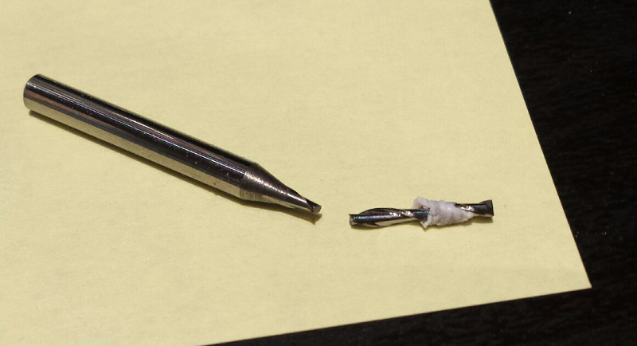

# Cutting plastics

Plastics are relatively easy to mill, but they are much less forgiving than wood if feeds and speeds are not set to adequate values. The reason is that plastic melts easily when heated, and since cutting forces produce heat...the name of the game is to evacuate heat as efficiently as possible.

This boils down to two things:

1\) **Make thick chips:**

 i.e. use a high chipload. Larger chips carry away more heat than smaller ones. To get a large chipload, one must use low RPM and high feedrates. As discussed in the [Feeds & speeds](feeds-and-speeds-basics.md) section, a good target chipload for plastics for a 1/4" endmill, is around 0.004" / 0.1mm. Such a chipload is not reachable with 3-flute endmills. Even at the lowest RPM \(10.000 RPM on the Makita\) and highest feedrate \(100"/ 2540mm per min\), the chipload would only be 100 / \(3x10.000\) = 0.0033. This is much worse on the DeWalt router, with a min of 16.000 RPM.

The optimal solution is to use a single-flute \(O-flute\) endmill : even with a min RPM of 16.000 on the DeWalt router, a feedrate of 70"/min \(1800mm/min\) is enough to reach the desired chipload. Makita users can get away with a 2-flute endmill. Chiploads for smaller tools \(1/8" and below\) are easier to reach, even with two flute endmills. Spindle owners can enjoy lower RPMs, 

2\) Make sure **chip evacuation** will not be a problem:

Even at the correct chipload, if chips get in the way of the cut, very soon some melting will happen. It is important to ensure that chips are evacuated efficiently, with one or several of the following solutions:

* dust shoe \(or manual vaccuuming\)
* air blast directed at the cut
* avoiding deep & narrow pockets/slots
* using an O-flute endmill \(beyond the chipload advantage, it also leaves much more room for chips to get away from the cut\)

Two very common types of plastic are hard plastics like acrylic \(cast or extruded\), and soft plastics like HDPE \(High Density PoyEthylene\)

## Acrylic

If the feeds and speeds are correct, you should be making chips, not strings of plastics :

If you get gummy edges on the cut, or see plastic accumulating on the endmill, then the feedrate is too low and/or the RPM too high. Here is what it may look like while the router is on:

and with the router turned off:

This string of plastic is an indication that rather than cutting, the endmill is melting & pushing plastic. You should stop the cut, because things will probably go bad quickly, with melted plastic accumulating in the flutes, leading to more rubbing and more melting, until the endmill is covered in plastic and is not cutting anything, and eventually breaks as the machine continues to move through the material:


In the [Feeds & speeds](feeds-and-speeds-basics.md) section, the recommandation for **plunge rate** was "_25% to 50% of the feedrate for wood and plastics_". You want to be on the high end of this range for plastics : plunging too slowly will result in a little melted plastic on the endmill at the beginning of the cut, just like on the pictures above. And then even if the feedrate is correct for the rest of the cut, if you accumulate these strings of material at the top of the endmill each time the tool plunges, you may end up in a situation where this is enough to get in the way of the cut, and then bad things happen.  


## HDPE

TODO describe feeds and speeds

O-flute 1.8" / 10.000RPM / 12000mm/min =&gt; CL 0.12

### Tips and tricks

TODO: air jet, coolant, O-flute, ...

