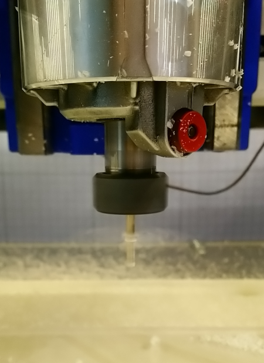

# Usecases: cutting plastics

Plastics are relatively easy to mill, but they are much less forgiving than wood if feeds and speeds are not set to adequate values. The reason is that plastic melts easily when heated, and since cutting forces produce heat...the name of the game is to evacuate heat as efficiently as possible.

This boils down to two things:

1\) ****Make **thick chips:**

 i.e. use a high chipload. Larger chips carry away more heat than smaller ones. To get a large chipload, one must use low RPM and high feedrates. As discussed in the [Feeds & speeds](feeds-and-speeds-basics.md) section, a good target chipload for plastics for a 1/4" endmill, is above 0.004" / 0.1mm. Such chiploads are hard to reach with 3-flute endmills. For example on the Dewalt router at its minimum RPM of 16.000, and at the highest possible feedrate \(196.85"/ 5000mm per min\), the chipload maxes out at 196 / \(3x16.000\) = 0.004".

A usual solution is to use a single-flute \(O-flute\) endmill, this will allow to reach a higher chipload and avoid using the max feedrate \(which comes with other issues, e.g. acceleration afte corners\). Chiploads for smaller tools \(1/8" and below\) are easier to reach, even with two flute endmills. Another solution is to use lower RPMs, but that is only possible for spindle owners, not for Makita/Dewalt routers.

2\) Make sure **chip evacuation** will not be a problem:

Even at the correct chipload, if chips get in the way of the cut, very soon some melting will happen. It is important to ensure that chips are evacuated efficiently, with one or several of the following solutions:

* dust shoe \(or manual vaccuuming\)
* air blast directed at the cut
* avoiding deep & narrow pockets/slots
* using an O-flute endmill \(beyond the chipload vs. RPM/feedrate advantage, it also leaves much more room for chips to get away from the cut\)

Two very common types of plastic are hard plastics like acrylic \(cast or extruded\), and soft plastics like HDPE \(High Density PolyEthylene\), both are illustrated below.

## Acrylic

If the feeds and speeds are correct, you should be making chips, not strings of plastics :

For this example I used a 2-flute 1/8" endmill, 10.000 RPM, and a feedrate of 1200mm/min \(47"/min\), to get a chipload of 1200 / \(2x10.000\) = 0.06mm = 0.0023", as recommended in the [Feeds & speeds](feeds-and-speeds-basics.md) section for acrylic. The depth of cut was 50% of the endmill diameter, i.e. 1.5875mm.

If you get gummy edges on the cut, or see plastic accumulating on the endmill, then the feedrate is too low and/or the RPM too high. Here is what it may look like while the router is on:

and with the router turned off:

This string of plastic is an indication that rather than cutting, the endmill is melting & pushing plastic. You should stop the cut, because things will probably go bad quickly, with melted plastic accumulating in the flutes, leading to more rubbing and more melting, until the endmill is covered in plastic and is not cutting anything, and eventually breaks as the machine continues to push it through the material:


In the [Feeds & speeds](feeds-and-speeds-basics.md) section, the recommandation for **plunge rate** was "_25% to 50% of the feedrate for wood and plastics_". You want to be on the high end of this range for plastics : plunging too slowly will result in a little melted plastic on the endmill at the beginning of the cut, just like on the pictures above. And then even if the feedrate is correct for the rest of the cut, if you accumulate these strings of material at the top of the endmill each time the tool plunges, you may end up in a situation where this is enough to get in the way of the cut, and then bad things happen.  


## HDPE

For HDPE, the chipload needs to be pushed even further, as this is a relatively soft plastic that melts easily.

To get nice clean chips below, I used a 1/8" O-flute at 10.000RPM and 1200mm/min \(47"/min\), granting a chipload of 0.12mm \(0.005"\). The depth of cut was again 50% of the endmill diameter, i.e. 1.5875mm

