# Usecases: cutting wood

These usecases are intended to illustrate how the information from the [Feeds & speeds](feeds-and-speeds-basics.md) section can be used to determine workable cutting parameters, for a project that uses wood as the stock material. Wood is quite forgiving, in the sense that the range of acceptable feeds and speeds is much larger than with _e.g._ plastics or metal. So this is by no means a recommendation about specific values to use for wood, but rather an example of how to make informed decisions about the types of endmills, feeds and speeds, and toolpaths for cutting wood.

## Bamboo tool holder

Ok, technically bamboo is not wood, but close enough. In this example, I wanted to make a holder for my endmills from a cheap \(Ikea\) 11'' × 18'' bamboo cutting board. I used the tape & glue method to secure it to the wasteboard.


I added extra pieces of similar thickness on the sides and front, this allows the dust shoe to not lose suction when it moves past the edge of the stock during the toolpath.


The design is very straightforward but has a lot of deep pockets, with tight corners that a 1/4'' endmill could not cut. And cutting of all this with a 1/8'' endmill would take forever:

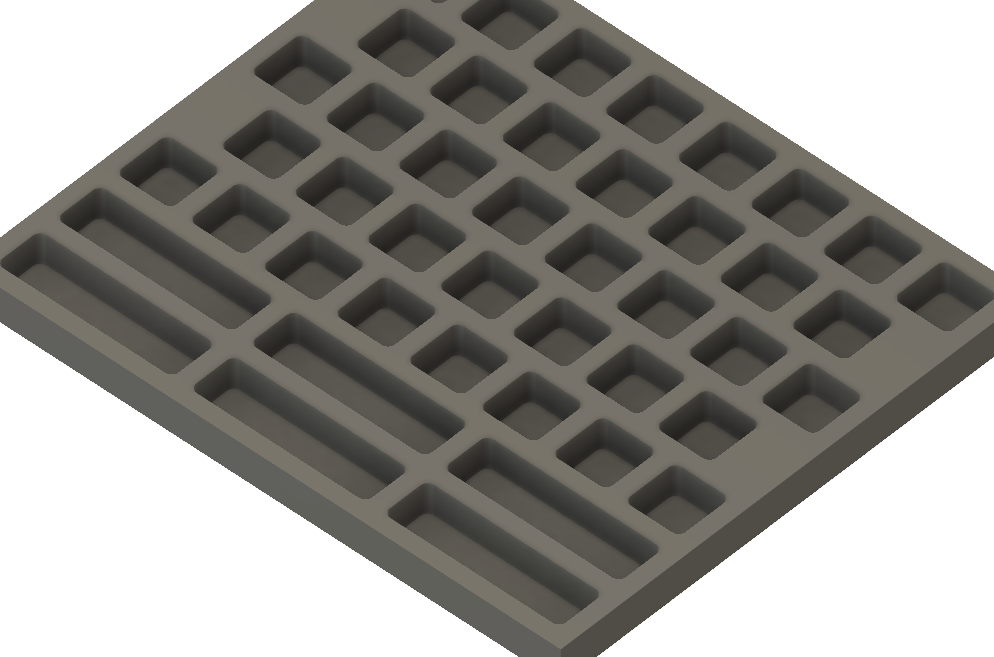

So I first created a roughing toolpath using a large \(6mm\) endmill, to do most of the clearing. 

* an **upcut** endmill is used, to have good chip evacuation and since there will be a finishing pass afterwards anyway to clean the rough top edges of the pockets.
* Using the **target chipload guideline** \(see [Feeds & speeds](feeds-and-speeds-basics.md#shapeoko-chiploads-guideline)\), and considering bamboo is somewhat easier to cut than "hard wood", I picked a target chipload value of 0.002''/ 0.055mm in the high-end of the range.
* While regular pocketing toolpaths would have worked fine, I chose to use an **adaptive clearing** toolpath, and with a stepover/radial width of cut/optimal load of 0.0315'' / 0.8mm \(13% of endmill diameter, a very conservative value for wood\)
* After taking **chip thinning** into account for a 13% stepover, the corrected target chipload is 0.0327'' / 0.083mm

$$
Chipload(adjusted) = \frac{6}{2 × \sqrt{(6 × 0.8) - (0.8)^2}}× 0.055 = 0.081mm = 0.00319''
$$

* Since my endmill has 2 flutes, and selecting 12,000 RPM as my speed, the required **feedrate** to reach that chipload value is 0.00319 × 2 × 12000 = 76.6ipm = 1945 mm/min
* Since the stepover is very low and the adaptive toolpath enabled it, I went for cutting the **full pocket depth** \(0.5'' = 12.7mm = 200% endmill diameter\) in one pass.
* I chose 400 mm/min for **plunge rate**, which is very conservative for wood especially considering I also used helical ramping into the material.
* I left 0.5mm radial **stock to leave**, that the finishing pass would take care of.

A preview of the toolpath gave me this:

and the cut proceeded uneventfully, taking about 40 minutes. Notice the fuzzies on the pocket edges though, due to the use of the upcut endmill:

I then created a finishing pass that would do two things: take care of cutting the corners to their final radius using a smaller \(1/8''\) endmill, and remove the 0.5mm remaining stock from the pocket walls.

* I used a **downcut** endmill, to get clean top edges. The poor chip evacuation is not an issue here since there is very little material to remove and it happens inside a large pocket with lots of space around the endmill.
* I picked a radial width of cut of 0.02'' / 0.55mm, i.e. just a bit more than the stock to leave from the previous pass, so that it will only take one pass on the walls \(and just a few passes in the corners\). That is only 17% of the endmill diameter anyway.
* Then to both cut the corners and remove the stock left from the previous pass, I selected the same geometry but used the **rest machining** option: the CAM tool is aware of the material already cut during the first pass, and will generate a toolpath that cuts the rest.
* The target chipload from the guideline for an 1/8'' endmill in hard wood is up to 0.001''/0.025mm, and since bamboo is somewhat softer and that I would only be cutting a thin layer of material, I aimed at a value a little higher, 0.0014'' / 0.035mm.
* Adjusted for chip thinning with 0.02''/0.55mm stepover, that's a 0.0019''/0.046mm chipload/
* Considering the 2 flutes on this endmill and 12,000RPM, that requires a feedrate of 43ipm = 1100mm/min
* Still using a full pocket depth cut.
* Still using a plunge rate of 400mm/min.

Thanks to the magic of rest machining, this finishing pass is quick \(7 minutes\):

Which gave me this result, right out of the machine, with perfect edges and no need for any clean-up/sanding:

## Plywood parts

A much simpler example now: doing profile cuts in plywood. Plywood is soft and easy to cut, but the top and bottom veneers are susceptible to tearout. A common solution to avoid tearout is to use a **downcut** endmill, which will leave clean edges on the top surface. However, the risk of tearout is then moved to the underside of the part. That's where **compression endmills** come in handy: they have both an upcut section at the tip, and a downcut section higher up the flutes:

To leverage this peculiar geometry, the endmill is intended to be used for cutting through a stock material which thickness matches the distance between the upcut and downcut parts of the endmill:

The downcut section of the flute will tend to push down on the stock material top surface, while the upcut section will tend to push up on the bottom surface \(hence the name "compression"\). The expected result is that both the top and the bottom surfaces should have no tearout.

Here is the result of trying the 1/8'' O-flute compression endmill shown above, for profile cuts in 0.2'' plywood. Feeds and speeds where set to 20,000RPM, 40ipm feedrate \(20ipm plunge rate\), 0.2'' depth of cut:

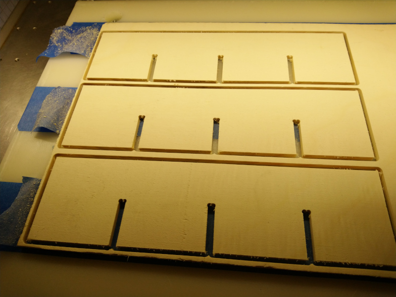

## V-carved inlays


This is basically my take on explaining v-carved inlays, based on this great video: [https://www.youtube.com/watch?v=l4VMo9DCzO8](https://www.youtube.com/watch?v=l4VMo9DCzO8)


Making wood inlays is a very popular technique, that is surprisingly easy once you understand the underlying principles. Like regular V-carving, it allows one to mill features that would otherwise be impossible to do with straight endmills, like stars or other pointy objects. It starts from the basic observation that if one uses a V-bit of a given taper angle, it is possible to cut a cavity AND the associated part filling that cavity, with the same tool, for a perfect match. Here's a basic example with a 60° V-bit:

To cut the **base**, one uses a regular v-carve toolpath, based on any 2D shapes \(as a convention these reference shapes constitute the "artwork plane"\). The toolpath only needs to cut down to a depth corresponding to the desired inlay thickness, however it is more practical to carve a bit deeper, to have a little bit of space for the glue that will hold the base and the inlay, and to cope for small depths errors:


This is the beauty of v-carved inlays: the slope introduced by the use of a V-bit, the extra depth margin \(glue gap\), and making the inlay a bit thicker than required, will ensure that even if the inlay depth is not a perfect match for the base, it will still fit perfectly, and one will only have to remove the excess material after glueing.


Now, cutting the **inlay** part itself requires a bit more caution: 

* the very first thing to notice is that the artwork needs to be **flipped** in the ****left/right direction \(i.e. to apply a 180° rotation along the Y axis, and have the inlay part facing "up" for the v-carve toolpath\). Unless the v-carved feature is perfectly symmetrical, this is essential or the inlay will not fit. 
* the second thing is that one needs to cut the inlay to be a bit thicker than strictly required, to allow for thickness errors and to leave some space between the base and the top of the inlay for cutting the excess material after assembly. This corresponds to the extra "**cutout depth**" on the figure below.
* finally, it is often convenient to add a solid **base underneath the inlay** part\(s\), especially when the artwork is such that many individual inlay pieces will be cut: the base will hold them all together during assembly.  

You should then end up with two pieces that match perfectly \(the V-bit angle does that for you\), and with the inlay sticking out from the final surface by the cutout depth plus the inlay base depth:

Below is an example project of carving a lotus flower inlay using a 60° V-bit. 


It was designed in Vectric's VCarve: its support for double-sided projects makes managing the base and the inlay in the same design file easier, but the same can be done in any CAD software supporting V-carving toolpaths.


First, I imported a vector design, and selected all parts of the artwork to carve the base:

I chose the inlay to be 3mm thick, and added a 0.6mm glue gap, so the v-carve toolpath has a start depth of 0, and a flat depth of 3.6mm:

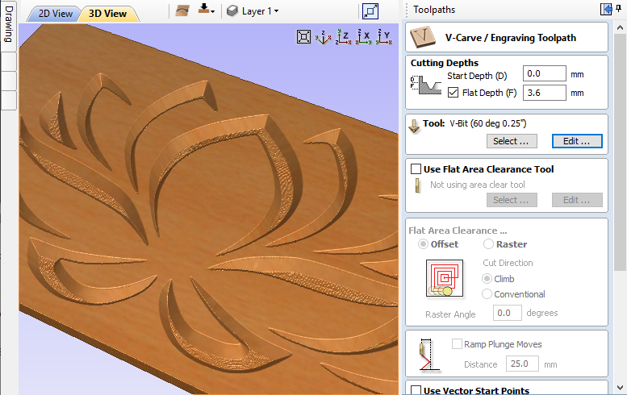

I ran that toolpath \(using a 60° V-bit at 24,000RPM, 60ipm feedrate, 14ipm plunge rate, 0.1'' pass depth, 0.06'' stepover\) and got this:

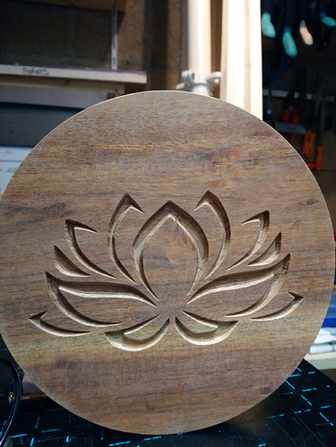

Next, I switched to the other layer to design the inlay part:

* I imported the same vector but **FLIPPED IT** left/right. This is important ! That lotus flower design is _almost_ symmetrical, but not quite.
* I selected all shapes and created an **offset** vector around them: this is used to create a boundary for the v-carve operation near the area of interest, and another toolpath is used to clear the rest of the material in the "boring" part:
  * you could decide to skip this step and use the V-bit to clear material all around the selected shapes, but V-bits are very inefficient for clearing large areas, so this would take forever.
  * you may need to clean-up artefacts generated by the offset operation, see yellow circles in the example below
* I also created a **perimeter** around everything, corresponding to the stock size \(outer rectangle in the example below\), to define the area where the flat pocketing operation will run.

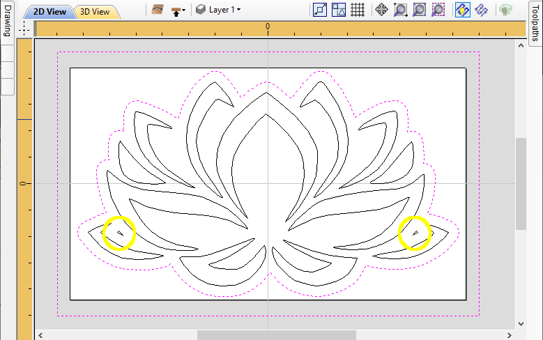

The bulk of the material, between the outer perimeter and inner offset shape, is removed using a square endmill, down to a \(flat\) depth of 3.65mm \(3mm inlay height, 0.6mm cutout depth, and an extra 0.05mm margin just because\):


Some CAM software products will support this clearance pass with a straight endmill natively, as part of the v-carve toolpath options. The idea remains the same, it just saves you the trouble of manually creating the offset shapes.


Now the most important step: I created the v-carve toolpath for the inlay itself. The trick is to select the \(flipped\) artwork, and then:

* use a **start depth** corresponding to the inlay thickness \(in my case 3mm\). This corresponds to the  height of the inlay above the artwork plane.
* use a **flat depth** corresponding to the extra/cutout margin.
  * here, I chose 0.6mm, but this is a coincidence, it has nothing to do with the glue gap depth in the base part. Since I did not intend to use a bandsaw for cutting the top of the inlay, 0.6mm provided enough margin for depth errors.

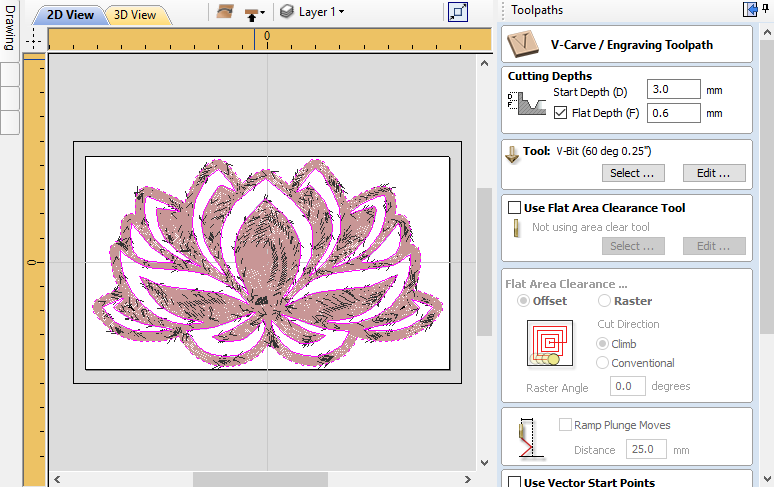

The preview after simulating both toolpaths shows the intended result:

After creating all this, I realized my walnut stock was...not large enough to accomodate the design in one go. No worries, I split the toolpaths between two smaller halves, and proceeded to prepare the stock:

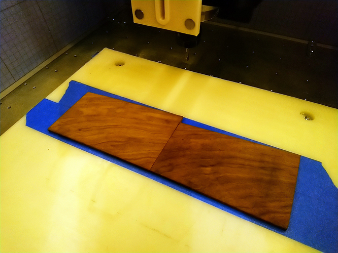

Which gave me this, after running both the pocketing \(clearing\) toolpath, and the v-carve toolpath:

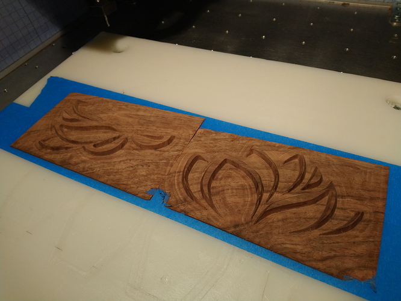

Then came the rewarding moment of inserting the inlay in the base, for a perfect fit. I used a generous amount of glue in the base, positioned the inlay\(s\), added weight on top, let it cure, and got this:

To remove the excess material, one way is to leave a large cutout depth, then use a bandsaw to cut in-between the base and the inlay base. I chose instead to use the Shapeoko to do a simple surfacing operation with a square endmill:

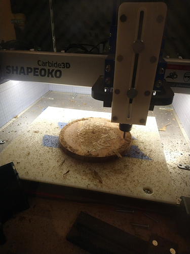

After a little sanding and oiling, the resulting inlay looks like this:

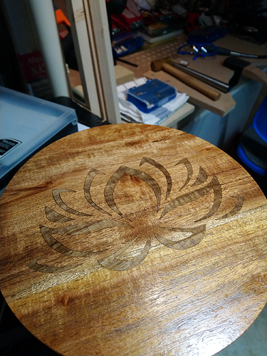

But inlays look much better when there is a lot of contrast between the base and the inlay, so I had another go at it: 

Community member **@i3oilermaker** used the same concept to make a beautiful serving tray that I wanted to share here, as a great example of what one can achieve with v-carved inlays:

* first, V-carving a maple base with a 30deg V-bit:

* Then running a clearance pass for the walnut inlay part, using a 1/8'' square endmill:

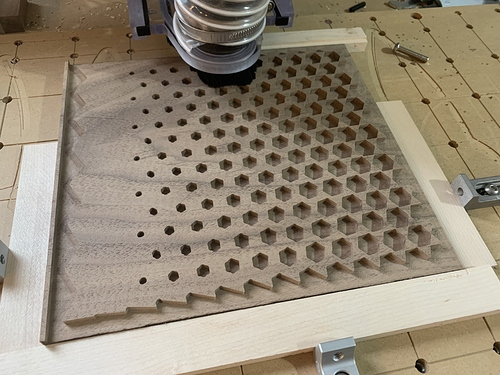

* Then running the V-carving pass itself, to get this:

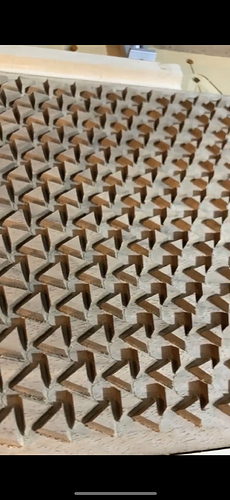

* And finally glueing the inlay onto the base, letting it dry, cutting the excess material with a surfacing bit, and finishing the part to get this beauty:

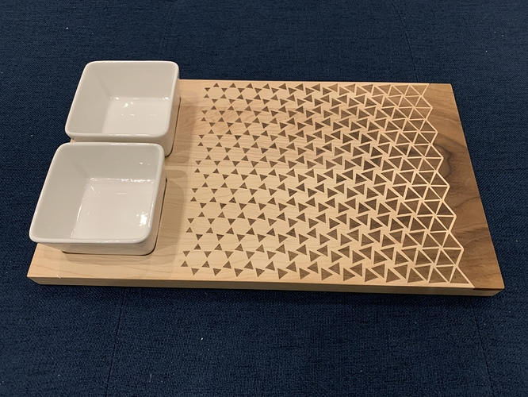

