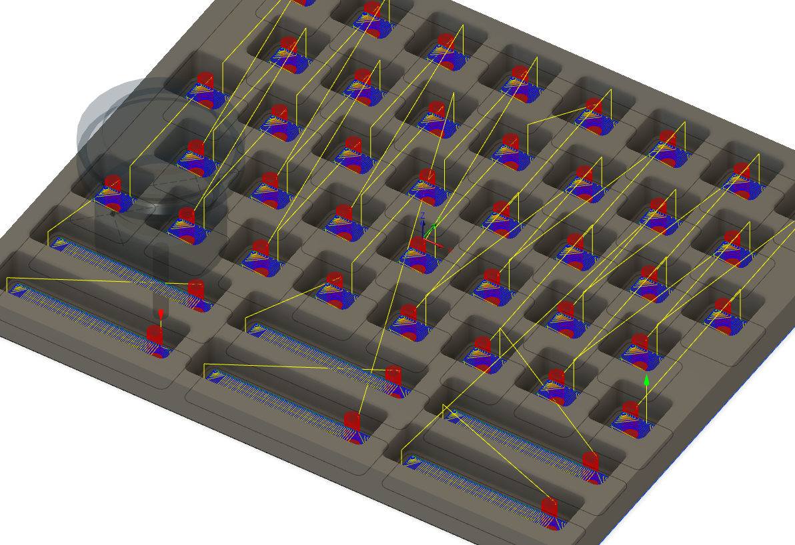
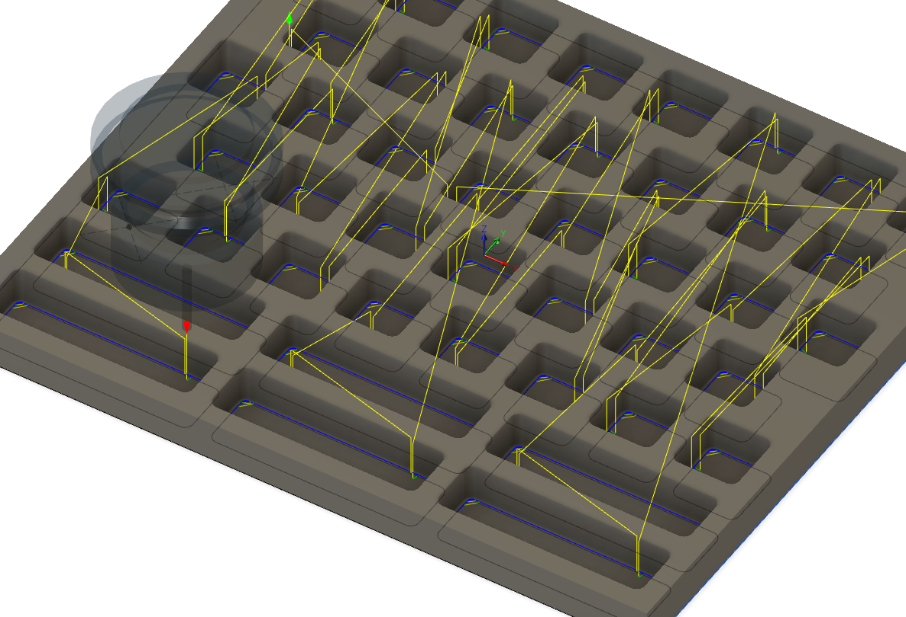

# Usecases: cutting wood

## General tips

Grain direction versus toolpath

Finding the sweet spot for feeds and speed

TODO: starting point + experimental approach + chatter signs

## Bamboo tool holder

Ok, technically bamboo is not wood, but close enough. In this example, I wanted to make a holder for my endmills from a cheap \(Ikea\) bamboo cutting board. I used the tape & glue method to secure it to the wasteboard.


I added extra pieces of about the same thickness on the sides and front, this allows the dust shoe to not lose suction when it moves past the edge of the stock during the toolpath.


The design is straightforward but has a lot of deep pockets, with tight corners:

So I first created a roughing toolpath using a large \(6mm\) endmill, to do most of the clearing. 

* Using the target chipload guideline \(see [Feeds & speeds](feeds-and-speeds-basics.md#shapeoko-chiploads-guideline)\), and considering bamboo is somewhat easier to cut than "hard wood", I picked a target chipload value of 0.003"/ 0.075mm, in-between hard wood and soft wood values.
* It was convenient to use an adaptive clearing toolpath, and I went for a stepover/radial width of cut/optimal load of 0.00315" / 0.8mm \(13% of endmill diameter, a conservative value for wood\)
* After taking chip thinning into account for a 13% stepover, the corrected target chipload is 0.0327" / 0.083mm
* Since my endmill has 2 flutes, and somewhat arbitrarily picking 12.000 RPM as my speed, the required feedrate to reach that value is 0.00327 \* 2 \* 12000 = 78.5ipm ~ 2000 mm/min
* Since the stepover is very low, I went for cutting the full pocket depth \(0.5" / 12.7mm\) in one \(adaptive\) pass

Roughing: 6mm 2flutes, 12.000RPM, FR 2000mm/min, 3D adaptive clearing, optimal load 0.8mm, plunge rate 400mm/min, target chip per tooth 0.07mm, corrected for chip thinning = 0.083mm, 0.5mm radial stock to leave, 14.2mm DOC \(full depth\)

xxx

Finishing: 3.175mm 2flutes downcut, 12.000RPM, FR 840mm/min, 3D adaptive clearing with Rest machning, optimal load 0.55mm, plunge rate 400mm/min, target chip per tooth 0.035mm, corrected for chip thinning = 0.0458mm, 14.2mm DOC \(full depth\)

vvvv

