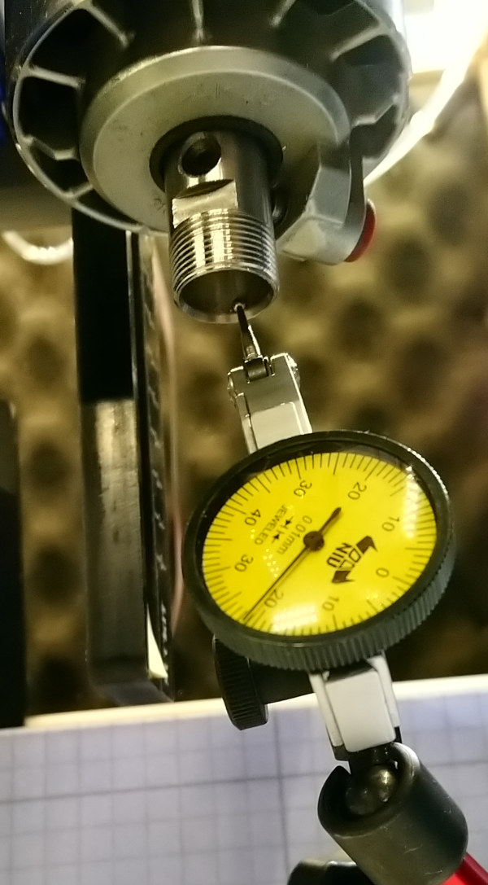
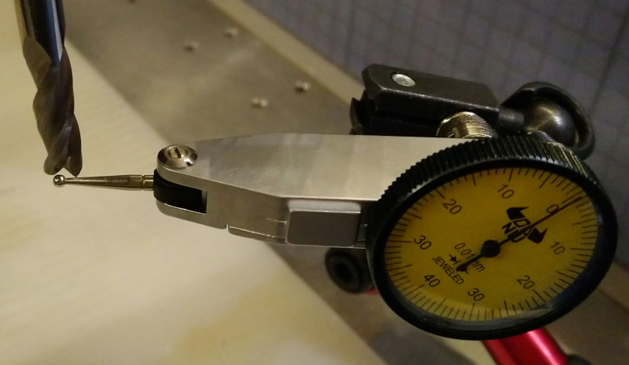
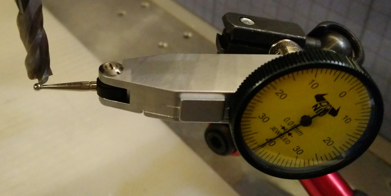
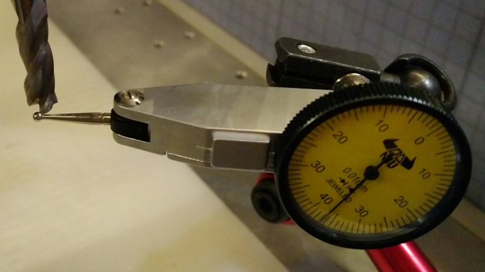
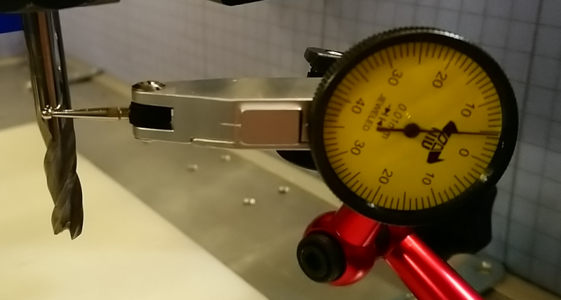

# Managing runout

## Why bother?

Runout was defined in the [Collets](collets.md) section. It is quite possible to ignore it and still succeed in making a lot of successful projets, but it is better to understand how to deal with it in at least two cases:

* projects requiring **dimensional accuracy**: since the toolpaths in the CAM tool take into account the endmill diameter, and since runout artificially increases the effective diameter, ignoring it will result in parts that have a dimensional error of \(at least\) the runout value.
* projects requiring **small endmills**, i.e. endmills smaller than 1/8", a.k.a micro-machining. The reason is that the endmill will see +/- 1 runout of variation on the chipload. Since runout can be of the same order of magnitude as the target chipload, a small endmill seeing a chipload twice as high as the optimal target value can easily break.

And beyond these two cases, runout is bad anyway for tool life, chatter, and surface finish.

## **Measuring runout**

The simplest way to measure runout is to do a test cut of a slot, measure the actual width of the resulting slot, then subtract the actual endmill diameter: the difference is the runout value. Unfortunately, it is not straightforward to determine precisely the actual diameter of a given endmill: they are manufactured within given tolerances, and are never quite the diameter they are sold to be. A 1/4" endmill could typically have an actual diameter anywhere between 0.245" and 0.255". Measuring precisely the actual diameter is not easy, as the measurement must be made on the flutes, and without proper tooling that can be difficult especially for endmill with an odd number of flutes.

Another way to measure runout is to use a **test indicator**, capturing the minimum and maximum values read over a 360° revolution of the endmill. Ideally, the runout should be measured at the tip of the endmill, where the cutting action is, but that means measuring on the flutes themselves. Alternatively, the dial indicator can be positioned on the shaft, as close as possible to the flutes, this will give a continuous readout of the runout over a 360° revolution, but could under-estimate the actual runout a bit.

**Runout** is the difference between the maximal and minimal values read, at a given measurement point. 

**TIR** \(Total Indicated Runout\) is the range of runout values if we were to measure across the full length of the endmill, so it boils down to the max runout.

Runout measured on the endmill is the result of the combination of the router runout, collet runout, and endmill runout. 

Router runout itself can be measured by positioning the test indicator inside the collet taper: 

In this case, the runout measured there was approximately 0.02mm \(0.0008"\). But what really matters is total runout at the tip of the endmill. Below is an illustration of measuring runout at the tip of a 3-flute 1/4" square endmill.

First, the test indicator is positioned at a point where no flutes touch it, and zero is set there.

then the endmill is rotated manually until the test indicator readout maxes out at the tip of the first flute. In this case it read 0.41mm:

the endmill is then rotated further and the deviation at the tip of the next flute is measured, in this case 0.37mm:

Ditto for the last flute, which read 0.42mm in this setup:

So the max difference is 0.42 -0.37 = **0.05mm runout**

As a comparison, measuring runout on the shaft, setting the indicator zero to the point giving the minimal readout,

gave a max value of about 0.045mm:

Not too far from the 0.05mm measured on the flutes, and easier to measure there. 

This example value of 0.05mm \(0.002"\) runout on a Makita router with the stock Makita collet and a 1/4" endmill is not great, but not really a concern in day to day use. It will vary significantly depending on which collet and endmill are used and how they were mounted. Another combination of collet/endmill on this same router granted a runout of only 0.02mm \(~0.0008"\).

## Reducing runout

* There is nothing one can do about the intrinsic runout of a specific router \(short of returning the router to get a new one, that _could_ have a lower runout, but that is random\)
  * **Spindles** usually have lower runout than routers, so upgrading to a spindle can be another  approach \(runout alone may not be a good enough reason to upgrade though\)
* Using **precision collets** is a simple way to help minimizing runout, and is one of the cheapest "upgrades" to the stock Shapeoko setup.
* Using quality endmills helps, but the endmill is probably not the main source of runout anyway.
* Watch out for **debris** stuck between the router taper and the collet, they will tilt things and create runout: always make sure the taper and collet are clean.
* Minimize **tool stickout**: this will minimize the effect of the axial runout.
* Considering that the final runout results from the relative positioning of the router, collet, and endmill, one can try to "**clock**" these three elements, so that the different runout contributions cancel each other to some extent. There is no easy way to determine runout of each element separately, so this can be a trial & error process, but worth trying:  slightly turn the collet inside the router taper, and/or turn the endmill inside the collet, and this _might_ yield a lower overall runout.
* Finally, a method that looks scary but gives surprisingly good results is **tapping** \(gently\) on the endmill shaft using a screwdriver and a mallet: 
  * first find the orientation of the endmill that gives the maximum readout on a dial indicator placed on the front side.
  * put a small piece of electrical tape or similar on the tip of the screwdriver, to soften the contact with the endmill
  * then...hit the back of the screwdriver with a mallet a couple of times, gently.
  * check runout and repeat if necessary. It takes a few tries to find the right amount of force. In this example, the original runout was around 0.002", and tapping the endmill reduced it to around 0.0006". This adjustment should hold, at least until the end of the current job with this endmill.

## Managing runout

Even if it can be minimized to some extent, some runout will always exist. A simple way to deal with it is to consider that you are using an equivalent endmill that is _slightly_ larger than the one you are actually using \(corresponding to the actual endmill diameter + runout\), measure this effective cutting diameter on a scrap piece of material, and then use that effective diameter in the CAM tool instead of the theoretical diameter.

This won't do anything about the negative aspects of runout like possible vibrations/chatter/poor surface finish, but at least it should give more accurate dimensions.

